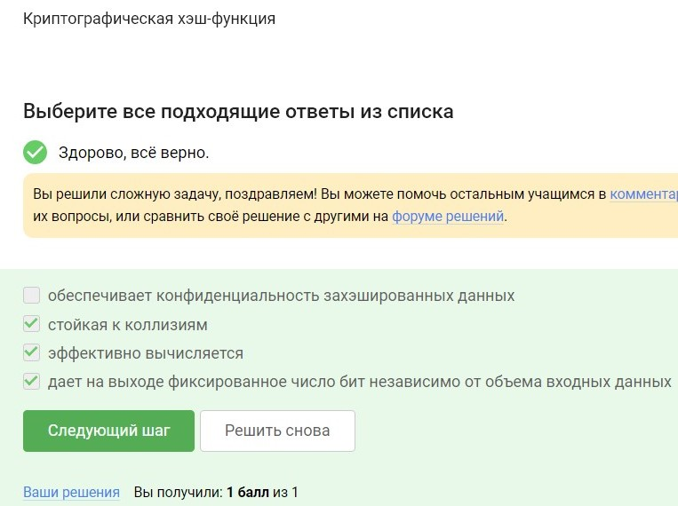

---
## Front matter
title: "Основы кибербезопастности"
subtitle: "Прохождение курса"
author: "Астраханцева А. А."

## Generic otions
lang: ru-RU
toc-title: "Содержание"

## Bibliography
bibliography: bib/cite.bib
csl: pandoc/csl/gost-r-7-0-5-2008-numeric.csl

## Pdf output format
toc: true # Table of contents
toc-depth: 2
lof: true # List of figures
lot: false # List of tables
fontsize: 12pt
linestretch: 1.5
papersize: a4
documentclass: scrreprt
## I18n polyglossia
polyglossia-lang:
  name: russian
  options:
	- spelling=modern
	- babelshorthands=true
polyglossia-otherlangs:
  name: english
## I18n babel
babel-lang: russian
babel-otherlangs: english
## Fonts
mainfont: PT Serif
romanfont: PT Serif
sansfont: PT Sans
monofont: PT Mono
mainfontoptions: Ligatures=TeX
romanfontoptions: Ligatures=TeX
sansfontoptions: Ligatures=TeX,Scale=MatchLowercase
monofontoptions: Scale=MatchLowercase,Scale=0.9
## Biblatex
biblatex: true
biblio-style: "gost-numeric"
biblatexoptions:
  - parentracker=true
  - backend=biber
  - hyperref=auto
  - language=auto
  - autolang=other*
  - citestyle=gost-numeric
## Pandoc-crossref LaTeX customization
figureTitle: "Рис."
tableTitle: "Таблица"
listingTitle: "Листинг"
lofTitle: "Список иллюстраций"
lotTitle: "Список таблиц"
lolTitle: "Листинги"
## Misc options
indent: true
header-includes:
  - \usepackage{indentfirst}
  - \usepackage{float} # keep figures where there are in the text
  - \floatplacement{figure}{H} # keep figures where there are in the text
---

# Цель работы

Прохождение курса "Основы кибербезопастности" и получение сертификата.

# Выполнение

## Безопасность в сети

### Как работает интернет: базовые сетевые протоколы

Протокол прикладного уровня в данном списке — это HTTPS.

UDP, TCP и IP являются протоколами более низких уровней. UDP и TCP относятся к транспортному уровню, а IP — к сетевому уровню (рис. [-@fig:001]).

{#fig:001 width=70%}

Протокол TCP работает на транспортном уровне (рис. [-@fig:002]). 

{#fig:002 width=70%}

Корректные адреса IPv4 в данном списке: 90.11.90.22 и  25.198.0.15. Варианты 421.0.15.19 и 43.12.256.7 - некорректные, так как значения в каждом октете могут быть от 0 до 255 (рис. [-@fig:003]). 

{#fig:003 width=70%}

DNS (Domain Name System) сервер переводит понятные для человека доменные имена (например, www.example.com) в IP адреса, которые используются устройствами для взаимодействия в сети. Это позволяет пользователям легко запоминать и вводить веб-адреса, вместо использования числовых IP адресов (рис. [-@fig:004]). 

{#fig:004 width=70%}

Модель TCP/IP состоит из четырех уровней. На верхнем уровне находится прикладной уровень, который взаимодействует с пользовательскими приложениями. Ниже него идет транспортный уровень, обеспечивающий передачу данных между хостами. Следующим идет сетевой уровень, отвечающий за маршрутизацию пакетов. На нижнем уровне находится канальный уровень, который управляет физической передачей данных через сеть. (рис. [-@fig:005]).

{#fig:005 width=70%}

Протокол HTTP (HyperText Transfer Protocol) передает данные в незашифрованном виде. Это означает, что данные, передаваемые между клиентом и сервером, могут быть перехвачены и прочитаны третьими сторонами. Для безопасной передачи данных используется протокол HTTPS, который шифрует данные с помощью SSL/TLS (рис. [-@fig:006]).

{#fig:006 width=70%}

Протокол HTTPS (HyperText Transfer Protocol Secure) включает в себя две основные фазы. Первая фаза — это "рукопожатие" (handshake), в ходе которой клиент и сервер устанавливают защищенное соединение, согласовывают параметры шифрования и аутентифицируют сервер (и, возможно, клиента). Вторая фаза — это передача данных, во время которой данные передаются в зашифрованном виде, обеспечивая их конфиденциальность и целостность (рис. [-@fig:007]).

{#fig:007 width=70%}

Во время установления защищенного соединения по протоколу TLS, клиент и сервер договариваются о версии протокола, которую они будут использовать. Этот процесс происходит в ходе "рукопожатия" (TLS handshake), где обе стороны сообщают свои поддерживаемые версии и выбирают наивысшую общую версию, чтобы обеспечить совместимость и безопасность соединения (рис. [-@fig:008]).

{#fig:008 width=70%}

Во время "рукопожатия" (TLS handshake), клиент и сервер согласовывают параметры для установки безопасного соединения, такие как выбор версии протокола, выбор алгоритмов шифрования и аутентификации, а также происходит аутентификация (как минимум одной из сторон) и формирование общего секретного ключа. Однако фаза "рукопожатия" не включает в себя шифрование данных, так как шифрование начинается только после успешного завершения этой фазы и установления защищенного соединения (рис. [-@fig:009]).

{#fig:009 width=70%}

### Персонализация сети

Куки могут хранить идентификатор пользователя, что позволяет веб-сайтам отслеживать пользователя и его предпочтения, и идентификатор сеанса, который помогает серверу отслеживать состояние сеанса для конкретного пользователя.

Пароль пользователя и IP-адрес обычно не хранятся в куки из соображений безопасности. Вместо этого пароль обычно хранится в зашифрованной форме на сервере, а IP-адрес может использоваться для идентификации пользователя, но не хранится непосредственно в куках (рис. [-@fig:010]).

{#fig:010 width=70%}

Куки применяются для различных целей, включая аутентификацию пользователя, персонализацию веб-страниц, отслеживание информации о пользователе и сбор статистики посещаемости сайта. Однако они не прямо связаны с улучшением надежности соединения. Улучшение надежности соединения может быть достигнуто за счет других мер безопасности, таких как использование протоколов шифрования (например, HTTPS) (рис. [-@fig:011]). 

{#fig:011 width=70%}

Куки генерируются и отправляются сервером в ответ на запрос от клиента. Когда клиент отправляет запрос на сервер, сервер может включить в ответ заголовок Set-Cookie, чтобы установить куки на стороне клиента (рис. [-@fig:012]). 

{#fig:012 width=70%}

Сессионные куки хранятся в браузере только на время активной сессии пользователя на веб-сайте. Как только пользователь закрывает окно браузера или завершает сеанс, сессионные куки обычно удаляются. (рис. [-@fig:013]). 

{#fig:013 width=70%}

### Браузер TOR. Анонимизация

Луковая сеть TOR использует три промежуточных узла для обеспечения анонимности пользователей. Когда пользователь отправляет запрос на веб-сайт через TOR, его запрос проходит через три промежуточных узла, прежде чем достигнет конечного назначения (рис. [-@fig:014]).

{#fig:014 width=70%}

В луковой сети TOR IP-адрес получателя известен отправителю, так как он должен знать, куда отправлять данные. Также IP-адрес получателя известен выходному узлу, так как это последний узел в цепочке, который фактически отправляет запрос на сервер получателя (рис. [-@fig:015]). 

{#fig:015 width=70%}

В луковой сети TOR общий секретный ключ генерируется между отправителем и каждым узлом в цепочке (охранным, промежуточным и выходным), так как каждый из узлов "снимает" один из слоев шифра (расшифровывает) (рис. [-@fig:016]). 

{#fig:016 width=70%}

Нет, пользователь не обязан использовать браузер Tor (или другой браузер, основанный на луковой маршрутизации) для успешного получения пакетов. TOR используется для анонимного и безопасного доступа к ресурсам в сети (рис. [-@fig:017]). 

{#fig:017 width=70%}

### Беспроводные сети Wi-fi

Wi-Fi является стандартом беспроводной связи, который позволяет устройствам подключаться к сети и обмениваться данными через радиоволновой сигнал. Этот стандарт определяется в IEEE 802.11 и используется для создания беспроводных локальных сетей (WLAN) (рис. [-@fig:018]).

{#fig:018 width=70%}

Протокол WiFi определяет способы доступа к беспроводной среде и форматирование данных для передачи через радиоканал. Это происходит на канальном уровне модели OSI, который отвечает за передачу данных по физической среде. (рис. [-@fig:019]). 

{#fig:019 width=70%}

WEP (Wired Equivalent Privacy) был одним из первых методов шифрования, использованных в беспроводных сетях Wi-Fi. Он устарел, в частности, потому, что использовал малую длину ключа: так, например, он использовал длину ключа в 40 бит, это довольно мало на сегодняшний день, он может быть легко взломан (рис. [-@fig:020]). 

{#fig:020 width=70%}

После успешной аутентификации устройств в сети Wi-Fi, данные, передаваемые между этими устройствами и роутером, могут передаваться в открытом виде. Тем не менее, если используется шифрование (например, WPA2 или WPA3), то данные передаются в зашифрованном виде после успешной аутентификации. (рис. [-@fig:021]). 

{#fig:021 width=70%}

WPA Personal — это тип аутентификации по паролю, который часто применяется в домашних сетях или небольших корпоративных сетях. В случае использования этого метода, каждый пользователь подключается к сети, используя общий предварительно установленный пароль. В отличие от этого, WPA Enterprise — это более сложный метод аутентификации, при котором существует централизованная база данных всех пользователей. При подключении к сети WiFi, пользователь проверяется в этой базе данных, что обычно хранится на специальных серверах. Этот метод обеспечивает более высокий уровень безопасности, но, как правило, он не требуется для небольших домашних сетей (рис. [-@fig:022]). 

{#fig:022 width=70%}

## Защита ПК/телефона

### Шифрование диска

Загрузочный сектор диска содержит информацию, необходимую для загрузки операционной системы при запуске компьютера. Этот сектор также может быть зашифрован, чтобы обеспечить дополнительный уровень безопасности и защиты данных на диске от несанкционированного доступа. (рис. [-@fig:023]). 

{#fig:023 width=70%}

В симметричном шифровании используется один и тот же ключ для шифрования и дешифрования данных. При шифровании диска такой ключ используется для зашифрования данных, а затем для их дешифрования при необходимости доступа к данным на диске (рис. [-@fig:024]). 

{#fig:024 width=70%}

Зашифровать жесткий диск с помощью следующих программ: BitLocker и VeraCrypt. Обе эти программы предоставляют возможность шифрования данных на жестком диске для обеспечения их безопасности и защиты от несанкционированного доступа.

Wireshark используется для анализа сетевого трафика, а Disk Utility (или Дисковая утилита) преимущественно для работы с дисками на операционных системах Mac OS (рис. [-@fig:025]). 

{#fig:025 width=70%}

### Пароли

Стойкими можно считать пароли, которые включают в себя сложную комбинацию символов, такие как буквы в верхнем и нижнем регистрах, цифры и специальные символы, и имеют достаточную длину для предотвращения атак методом перебора (рис. [-@fig:026]). 

{#fig:026 width=70%}

Менеджеры паролей представляют собой защищенное приложение, которое помогает хранить и организовывать пароли, обеспечивая их безопасность с помощью мощного шифрования и других мер безопасности. При использовании менеджера паролей пользователю необходимо помнить только один основной пароль для доступа к приложению, а все остальные пароли хранятся в безопасном хранилище (рис. [-@fig:027]). 

{#fig:027 width=70%}

Капча представляет собой тест, который обычно решают люди легко, но который сложно или невозможно выполнить для компьютерных программ или роботов. Она используется для различия между человеком и автоматизированными программами (ботами), что помогает защитить веб-ресурсы от спама, несанкционированного доступа и других видов вредоносной деятельности (рис. [-@fig:028]). 

{#fig:028 width=70%}

Хэширование паролей преобразует пароль в непонятную для человека строку (хэш), которая не может быть преобразована обратно в исходный пароль. Это обеспечивает безопасное хранение паролей на сервере, так как даже если злоумышленник получит доступ к базе данных хэшей паролей, ему будет крайне сложно или невозможно восстановить исходные пароли (рис. [-@fig:029]). 

{#fig:029 width=70%}

Использование соли (случайной дополнительной строки, добавляемой к паролю перед хэшированием) не поможет улучшить стойкость паролей к атаке перебором, если злоумышленник получил доступ к серверу.

Соль предназначена для усложнения процесса подбора паролей. Однако, если злоумышленник получил доступ к серверу и базе данных паролей, то соль также будет доступна ему, что делает ее бесполезной для защиты паролей в этом случае. (рис. [-@fig:030]). 

{#fig:030 width=70%}

Все приведенные методы защищают от утечек данных атакой перебором (рис. [-@fig:031]). 

{#fig:031 width=70%}

### Фишинг

Выбранные ссылки могут пытаться подделать легитимные веб-сайты банков и интернет-провайдеров, чтобы получить доступ к учетным данным пользователей. Необходимо обратить внимание, что настоящие страницы входа в банковские или почтовые аккаунты обычно имеют домены, которые принадлежат этим организациям, а не сторонним сервисам, как в приведенных примерах. (рис. [-@fig:032]). 

{#fig:032 width=70%}

Фишинговое письмо может прийти от знакомого адреса. Злоумышленники могут подделывать адрес отправителя, делая его похожим на адрес знакомого или даже настоящего контакта, чтобы убедить получателя открыть вредоносный вложение или перейти по ссылке на поддельный веб-сайт (рис. [-@fig:033]). 

{#fig:033 width=70%}

### Вирусы. Примеры

Спуфинг - это метод, который используется для изменения адреса отправителя электронной почты, делая его похожим на адрес, с которого обычно приходят легитимные сообщения. Это может использоваться злоумышленниками для фишинговых атак или распространения вредоносных программ (рис. [-@fig:034]). 

{#fig:034 width=70%}

Вирус-троян получил свое название от легенды о древнегреческом троянском коне, который скрывал в себе вооруженных воинов. Такой вирус маскируется под полезное или легитимное программное обеспечение, чтобы обмануть пользователя и получить доступ к системе или данных (рис. [-@fig:035]). 

{#fig:035 width=70%}

### Безопасность мессенджеров

Ключ шифрования в протоколе мессенджеров Signal формируется при генерации первого сообщения стороной-отправителем. Это обеспечивает конфиденциальность и безопасность обмена сообщениями с момента начала общения между отправителем и получателем (рис. [-@fig:036]). 

{#fig:036 width=70%}

Суть сквозного шифрования заключается в том, что сообщения передаются по узлам связи (серверам) в зашифрованном виде. Это означает, что данные шифруются на устройстве отправителя и дешифруются только на устройстве получателя, при этом промежуточные серверы (узлы связи) не имеют доступа к содержанию сообщений (рис. [-@fig:037]). 

{#fig:037 width=70%}

## Криптография на практике

### Введение в криптографию

В асимметричных криптографических примитивах обе стороны имеют пару ключей. Это пара ключей состоит из открытого и секретного ключей.  Открытый ключ публикуется в открытом доступе, а закрытый или секретный ключ сторона хранит у себя (рис. [-@fig:038]). 

{#fig:038 width=70%}

Криптографическая хэш-функция является стойкой к коллизиям, эффективно вычисляется и дает на выходе фиксированное число бит независимо от объема входных данных.Криптографическая хэш-функция не обеспечивает конфиденциальность данных, она используется для генерации хэш-кодов (рис. [-@fig:039]). 

{#fig:039 width=70%}

К алгоритмам цифровой подписи относятся RSA, ECDSA и ГОСТ Р 34.10-2012. AES и SHA2 относятся к алгоритмам шифрования, но не к алгоритмам цифровой подписи (рис. [-@fig:040]). 

{#fig:040 width=70%}

Код аутентификации - это симметричный примитив, который берет на вход какой-то ключ (это должен быть другой ключ, не тот, с которого мы шифровали) и сообщение и выдает код аутентификации сообщения. Корректно об этом примитиве думать, как о симметричной версии подписи. Как правило, код аутентификации сообщения строится с помощью хэш-функции или симметричного шифрования. Код аутентификации обеспечивает целостность данных (рис. [-@fig:041]). 

{#fig:041 width=70%}

Самым популярным примером протокола обмена ключами является протокол Диффи-Хэллмана, как раз он, либо его модификации используются в современных мессенджерах и в протоколе TLS для того, чтобы мы смогли сгенерировать **общий секретный ключ** и дальше шифровать наши данные с помощью симметричного алгоритма, то есть с помощью ключа skAB. Если реализовать генерацию общего ключа так, как она описана у Диффи-Хэллмана, мы получим довольно слабый протокол, нестойкий к активным злоумышленникам. Сделать этот протокол стойким к активным злоумышленникам помогает цифровая подпись (рис. [-@fig:042]). 

{#fig:042 width=70%}

### Цифровая подпись

Протокол электронной цифровой подписи относится к протоколам с публичным (или открытым) ключом. Эти протоколы используют пару ключей - публичный (или открытый) и приватный (секретный) - для создания и проверки цифровых подписей (рис. [-@fig:043]). 

{#fig:043 width=70%}

Алгоритм верификации электронной цифровой подписи требует на вход подпись, открытый ключ, сообщение. Это позволяет алгоритму проверить подлинность сообщения с использованием открытого ключа, соответствующего закрытому ключу, с помощью которого была создана цифровая подпись (рис. [-@fig:044]). 

{#fig:044 width=70%}

Электронная цифровая подпись не обеспечивает конфиденциальность. Электронная цифровая подпись обеспечивает аутентификацию, целостность и неотказ от авторства, но не скрывает содержимое сообщения от посторонних лиц (рис. [-@fig:045]). 

{#fig:045 width=70%}

Усиленная неквалифицированная подпись может быть подтверждена сертификатом, который может быть выпущен самостоятелно, то есть кроме того, что пользователь выпускает свою пару секретных ключей, он еще и может сам их сертифицировать. Такая подпись может быть использована в коммерческом документообороте в небольших негосударственных структурах. А вот что касается усиленной квалифицированной подписи, эта подпись уже имеет юридическую силу, она, как правило, равнозначна рукописной (рис. [-@fig:046]). 

{#fig:046 width=70%}

Получиь квалифицированный сертификат ключа проверки электронной подписи можно в удостоверяющем (сертификационном) центре. Эти центры имеют соответствующие полномочия и аккредитации для выдачи квалифицированных сертификатов, которые имеют юридическую силу (рис. [-@fig:047]). 

{#fig:047 width=70%}

### Электронные платежи

Платежные системы: MasterCard - одна из крупнейших мировых платежных систем. МИР - российская национальная платежная система. Платежные системы обычно обеспечивают возможность осуществления электронных и физических транзакций между покупателем и продавцом, включая торговлю онлайн, в магазинах и через банкоматы (рис. [-@fig:048]). 

{#fig:048 width=70%}

Данные примеры демонстрируют использование нескольких факторов (что-то, что пользователь знает и что-то, что пользователь имеет или может получить) для повышения безопасности процесса аутентификации (рис. [-@fig:049]). 

{#fig:049 width=70%}

При онлайн платежах сегодня используется многофакторная аутентификация покупателя перед банком-эмитентом. Это означает, что для подтверждения платежа требуется предоставление нескольких видов аутентификационных данных или факторов безопасности, таких как пароль, одноразовый код, отпечаток пальца или другие подтверждения, чтобы обеспечить дополнительный уровень безопасности и защиты от мошенничества (рис. [-@fig:050]). 

{#fig:050 width=70%}

### Блокчейн

Свойство криптографической хэш-функции, которое используется в доказательстве работы, это сложность нахождения прообраза. Доказательство работы включает в себя выполнение некоторой вычислительной работы, результат которой должен удовлетворять определенным критериям, например, начинать с определенного количества нулей в хэш-значении. Это требование обеспечивает, что выполнение работы требует значительных вычислительных ресурсов (рис. [-@fig:051]). 

{#fig:051 width=70%}

Консенсус в терминах криптовалют представляет собой общепризнанное соглашение, закодированное в общедоступной структуре данных, известной как "бухгалтерская книга". Этот "ledger" хранит историю всех транзакций, учитывая, кто передал какие средства кому и когда. Эта структура данных должна соответствовать четырем основным принципам. Во-первых, это постоянство, что означает, что добавленные данные не должны быть удалены. Во-вторых, это единое мнение, или сам конченсу, когда все участники видят и соглашаются с одинаковыми данными, за исключением недавних изменений. В-третьих, это живучесть, что позволяет добавлять новые транзакции по мере необходимости. И, наконец, открытость, так как любой может стать участником этой структуры данных блокчейна, по крайней мере, в случае с Bitcoin (рис. [-@fig:052]). 

{#fig:052 width=70%}

Секретные ключи, которые хранят участники блокчейна, относятся к криптографическому примитиву "цифровая подпись". Эти ключи используются для создания и верификации цифровых подписей, которые подтверждают подлинность и авторство транзакций в блокчейне (рис. [-@fig:053]). 

{#fig:053 width=70%}

На этом курс заканчивается. После прохождения сертификат не выдается, а лишь появляется уведомление об успешном пролхождении (рис. [-@fig:054]). 

{#fig:054 width=70%}

# Выводы

В ходе прохождения курса "Основы кибербезопастности" я узнала новую полезную информацию о бнзопасности в сети и криптографии.

