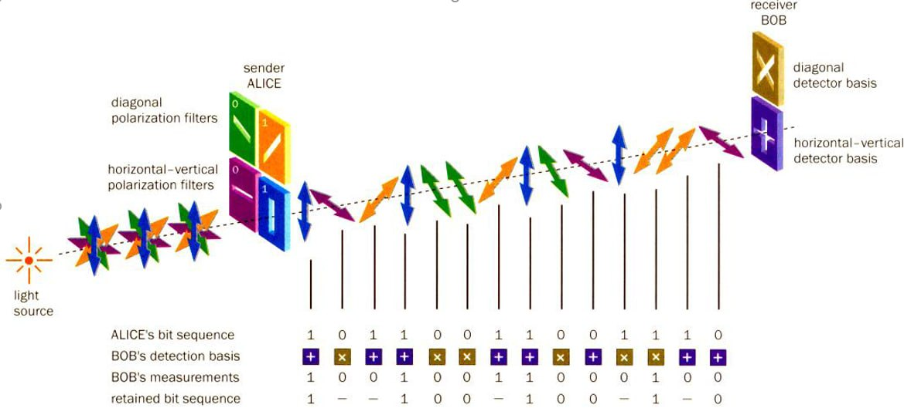

---
## Front matter
title: "Квантовое шифрование. Квантовая передача информации"
subtitle: "Основы информационной безопастности"
author: "Астраханцева А. А., НКАбд-01-22"

## Generic otions
lang: ru-RU
toc-title: "Содержание"

## Bibliography
bibliography: bib/cite.bib
csl: pandoc/csl/gost-r-7-0-5-2008-numeric.csl

## Pdf output format
toc: true # Table of contents
toc-depth: 2
lof: true # List of figures
lot: false # List of tables
fontsize: 12pt
linestretch: 1.5
papersize: a4
documentclass: scrreprt
## I18n polyglossia
polyglossia-lang:
  name: russian
  options:
	- spelling=modern
	- babelshorthands=true
polyglossia-otherlangs:
  name: english
## I18n babel
babel-lang: russian
babel-otherlangs: english
## Fonts
mainfont: PT Serif
romanfont: PT Serif
sansfont: PT Sans
monofont: PT Mono
mainfontoptions: Ligatures=TeX
romanfontoptions: Ligatures=TeX
sansfontoptions: Ligatures=TeX,Scale=MatchLowercase
monofontoptions: Scale=MatchLowercase,Scale=0.9
## Biblatex
biblatex: true
biblio-style: "gost-numeric"
biblatexoptions:
  - parentracker=true
  - backend=biber
  - hyperref=auto
  - language=auto
  - autolang=other*
  - citestyle=gost-numeric
## Pandoc-crossref LaTeX customization
figureTitle: "Рис."
tableTitle: "Таблица"
listingTitle: "Листинг"
lofTitle: "Список иллюстраций"
lotTitle: "Список таблиц"
lolTitle: "Листинги"
## Misc options
indent: true
header-includes:
  - \usepackage{indentfirst}
  - \usepackage{float} # keep figures where there are in the text
  - \floatplacement{figure}{H} # keep figures where there are in the text
---

# Список сокращений

IBM  – International Business Machines

ФЭУ – Фотоэлектронный умножитель

РКЦ - Российский Квантовый Центр

ЭПР - Эйнштейн-Подольский-Розен

МГУ – Московский государственный университет

ИТМО – университет Информационных технологий, механики и оптики

ОАО – Открытое акционерное общество

ЛЭТИ – Ленинградский Электротехнический университет 

НИТУ МИСИС – Национальный исследовательский технологический университет, Московский институт стали и сплавов

# Введение

В современном цифровом мире, где информация играет ключевую роль во всех сферах деятельности, безопасность передачи и хранения данных становится предметом все более острой озабоченности. С развитием информационных технологий возникают все более сложные угрозы для конфиденциальности и целостности информации, требующие разработки и применения более надежных и эффективных методов защиты. В этом контексте квантовое шифрование и квантовая передача информации выделяются как перспективные направления, обещающие революцию в области криптографии и безопасности данных.

Квантовое шифрование, основанное на принципах квантовой механики, предлагает новые подходы к защите информации, невосприимчивые к атакам квантовых компьютеров и методам криптоанализа, используемым в классических криптосистемах. Основная идея квантового шифрования заключается в использовании квантовых свойств частиц, таких как квантовое состояние и неразрушающее измерение, для создания криптографических протоколов, обеспечивающих высокую стойкость к взлому.

Квантовая передача информации, в свою очередь, представляет собой способ передачи квантового состояния между удаленными участниками с гарантированным сохранением конфиденциальности. Этот метод коммуникации основан на явлении квантовой запутанности, позволяющем сделать передачу данных абсолютно защищенной от прослушивания или подмены.

В данном докладе рассматриваются основные концепции и принципы квантового шифрования и передачи информации, а также  практические применения и потенциальные вызовы на пути внедрения квантовых технологий в сферу информационной безопасности.

# Основы квантового шифрования

Квантовая криптография представляет собой подход к обеспечению безопасности коммуникаций, использующий принципы квантовой физики. 

Впервые идея защиты информации с помощью квантовых объектов была предложена Стивеном Визнером в 1970 году. Десять лет спустя Чарльз Беннет из IBM и Жиль Брассар из Монреальского университета, вдохновленные работой Визнера, предложили передавать секретные ключи с использованием квантовых объектов.

Первый протокол квантовой криптографии (BB84) был предложен и опубликован в 1984 году Беннетом и Брассардом. Позднее идея была развита Экертом в 1991 году. Основанная на наблюдении квантовых состояний фотонов, методика квантовой криптографии представляет собой инновационный подход к обеспечению безопасности передачи данных. Отправитель задает квантовые состояния, а получатель регистрирует их, используя принцип неопределенности, который утверждает, что две квантовые величины не могут быть измерены одновременно с требуемой точностью. В данном случае поляризация фотонов может быть ортогональной (горизонтальной или вертикальной), циркулярной (левой или правой) и диагональной (45° или 135°) (рис. [-@fig:001]).

{#fig:001 width=70%}

Отправитель кодирует данные, устанавливая определенные квантовые состояния, которые затем регистрируются получателем. После этого обе стороны совместно анализируют результаты и договариваются о базовых состояниях. Таким образом, можно с высокой степенью уверенности гарантировать, что переданная и принятая последовательности данных идентичны. Обсуждение результатов касается ошибок, вызванных шумом или злоумышленниками, и не раскрывает содержание переданного сообщения. В качестве источника света может использоваться светодиод или лазер, который фильтруется, поляризуется и формируется в виде коротких импульсов. Получатель измеряет поляризацию фотонов, используя произвольную последовательность базовых состояний, а затем отправитель уведомляет его о правильности базовых состояний. Реализация протокола усложняется наличием шума, который может вызвать ошибки, но эти ошибки могут быть обнаружены и устранены с помощью подсчета четности.  

В 1991 году Беннет внедрил следующий алгоритм для отслеживания изменений в данных, передаваемых с использованием квантовых преобразований:

1. Отправитель и получатель договариваются о случайном перестановке битов в строках, чтобы сделать положения ошибок случайными.

2. Строки разбиваются на блоки размером k (значение k выбирается таким образом, чтобы вероятность ошибки в блоке была минимальной).

3. Для каждого блока отправитель и получатель вычисляют результаты и обмениваются ими. Последний бит каждого блока удаляется.

4. Если четность для какого-либо блока отличается, получатель и отправитель производят итеративный поиск и исправление ошибок.

5. Чтобы исключить возможные множественные ошибки, операции предыдущих пунктов повторяются для более крупного значения k.

6. Чтобы обнаружить возможные незамеченные ошибки, получатель и отправитель выполняют псевдослучайные проверки: они открыто объявляют о случайном перемешивании половины битов в строках; затем они сравнивают четности (если строки различаются, то четности должны не совпадать с вероятностью 1/2); в случае несоответствия, получатель и отправитель используют двоичный поиск и удаляют неверные биты.

7. После m итераций, если отличий нет, получатель и отправитель получают идентичные строки с вероятностью ошибки 2-m.

## Схема реализации квантовой криптографии 

{#fig:002 width=70%}

Слева располагается передающая сторона, а справа - принимающая (рис. [-@fig:002]). Свет со светоизлучающего диода попадает на коллиматор - оптическое устройство, используемое для создания параллельного пучка света. Он позволяет ограничить и выровнять пучок света, обеспечивая его прямолинейное распространение. В контексте квантовой криптографии, коллиматор может применяться для направления квантовых сигналов или фотонов по определенному пути в квантовой системе передачи данных. Он помогает сфокусировать и усилить поток квантов, что может быть важно для эффективной работы устройства. После коллиматора и поляризатора идут Ячейки Покеля. В схеме реализации квантовой криптографии - это оптические устройства, используемые для изменения поляризации фотонов в квантовой системе передачи данных. Они позволяют передатчику формировать определенные состояния поляризации для передаваемых фотонов, а приемнику анализировать их для дальнейшей обработки. Передатчик способен формировать одно из четырех состояний поляризации, управляющие сигналы для которого поступают в виде данных. В качестве среды передачи информации может выступать оптоволокно. При этом первичным источником света может служить лазер.

На принимающей стороне системы, сразу после прохождения через ячейку Покеля, устанавливается кальцитовая призма. Она разделяет пучок на два фотодетектора (ФЭУ), которые измеряют две ортогональные составляющие поляризации. Проблема, связанная с интенсивностью импульсов квантов, возникает при их формировании. Если в импульсе содержится, например, 1000 квантов, то возможность перехвата 100 из них злоумышленником на пути не исключена. Далее, анализируя открытые переговоры между отправителем и получателем, он может получить необходимую информацию. Поэтому оптимальное количество квантов в импульсе составляет около единицы. В таком случае любая попытка перехвата части квантов приведет к значительным изменениям в системе в целом и, как следствие, увеличит число ошибок на стороне получателя. В подобных ситуациях полученные данные должны быть отброшены, а передача повторена. Однако, при усилении защиты канала от перехвата, специалисты сталкиваются с проблемой "темнового" шума приемника - получения сигнала, который не был отправлен передающей стороной. Для обеспечения надежности передачи данных, логическому нулю и единице могут соответствовать определенные последовательности состояний, которые допускают коррекцию как одиночных, так и множественных ошибок.

Дальнейшее увеличение устойчивости квантовой криптосистемы возможно благодаря использованию эффекта ЭПР. В 1991 году Артур Экерт разработал квантовый протокол, опираясь на свойства так называемых "запутанных" состояний квантовых частиц. Для этого он применил пару частиц, известных как ЭПР-пара (где ЭПР означает Эйнштейн-Подольский-Розен), которые были представлены в статье 1935 года, содержащей одноименный парадокс. При этом сферически симметричный атом излучает два фотона в противоположных направлениях. Фотоны излучаются с неопределенной поляризацией, однако их поляризации всегда противоположны в силу симметрии. Одной из ключевых особенностей этого эффекта является то, что поляризация фотонов становится известной только после измерения. На основе этого эффекта Экерт предложил криптосхему, гарантирующую безопасность пересылки и хранения ключа. Отправитель создает ЭПР фотонные пары, оставляя один фотон для себя и передавая второй своему партнеру. При этом, если эффективность регистрации близка к 100%, при получении отправителем значения поляризации 1, его партнер регистрирует значение 0, и наоборот. Таким образом, партнеры могут получить идентичные псевдослучайные кодовые последовательности всякий раз, когда это требуется. Практическая реализация данной схемы осложнена из-за низкой эффективности регистрации и измерения поляризации одиночного фотона.

# Квантовая передача информации

Одно из основных применений квантовой телепортации связано с областью квантовой криптографии. Суть этой концепции заключается в невозможности клонирования одиночного фотона. Таким образом, передача информации может осуществляться через такой одиночный фотон, и никто не способен скопировать ее. Более того, любая попытка манипулировать этой информацией приведет к изменению или разрушению состояния фотона. В результате любые попытки несанкционированного доступа к информации будут обнаружены. Этот принцип может быть применен в области криптографии для защиты информации. Однако передается не сама полезная информация, а ключ, который впоследствии может использоваться для абсолютно надежной передачи информации по классическим каналам.

Квантовая телепортация — это процесс передачи состояния, а не конкретных объектов или энергии. Она основана на квантовых свойствах частиц, которые позволяют передавать информацию, не раскрывая ее содержание. Например, обычные методы передачи информации требуют множества измерений, которые могут нарушить квантовое состояние исходной информации. В отличие от этого, квантовая телепортация позволяет передавать состояние с минимальной информацией о нем, сохраняя его конфиденциальность.

В процессе квантовой телепортации используются кубиты, которые являются базовыми элементами передаваемого состояния. Кубит находится в суперпозиции двух состояний, в отличие от классического бита, который может быть только 0 или 1. Пока не произведено измерение, состояние кубита неопределенно. Это позволяет передавать информацию, используя минимальное количество кубитов. В квантовой механике даже одно уникальное состояние можно передать, в то время как в классических системах это невозможно. Для этого применяется эффект запутанности.

Квантовая запутанность — это специально подготовленные пары квантовых объектов, таких как фотоны, которые оказываются взаимосвязанными. Это означает, что измерение одного фотона определяет состояние другого, даже если они находятся на большом расстоянии друг от друга. Это свойство позволяет использовать квантовую запутанность для передачи информации, сохраняя ее конфиденциальность. При этом применение квантовой запутанности основано на теореме о невозможности клонирования квантовых состояний, что обеспечивает безопасность передачи информации.

Протокол квантовой телепортации, основанный на квантовой запутанности, позволяет передавать сложные состояния с помощью минимального количества информации. Например, с помощью двух бит информации можно телепортировать сложное состояние, которое невозможно закодировать этими битами.

# Практические применения квантового шифрования

Рынок квантовых технологий остается небольшим, одной из первых компаний, ориентированных на коммерческое использование квантовой криптографии, является ID Quantique. Она была основана выходцами из Женевского университета, включая Николя Жизана, выдающегося физика. Однако первыми на коммерческий рынок вышли американские Magiq Technologies Inc. В 2003 году компания представила свою систему квантового распределения ключей, способную работать на расстоянии до 120 километров.

ID Quantique также запустила свою систему на рынок вскоре после этого и быстро стала одним из лидеров отрасли. Она применила квантовые технологии для защиты данных во время выборов в Женеве в 2007 году и установила рекорд по дальности передачи квантовых данных по оптоволоконному кабелю в феврале 2018 года — 421 километр.

Одной из основных проблем квантовой связи до сих пор остаются дальность и скорость передачи данных. Это связано с тем, что передаваемые данные кодируются в состояниях одиночных фотонов, что делает линии квантовой связи очень уязвимыми для помех и шумов. В результате на практике квантовой ключ передается только на расстояниях до 100 километров в магистральных сетях. Для больших расстояний скорость передачи ключей становится недостаточной.

На сегодняшний день на рынке коммерческих систем квантовой коммуникации преобладают три компании: китайские Qasky и QuantumCTek, а также швейцарская ID Quantique. Они предлагают широкий спектр решений и компонентов для квантовой связи. Например, ID Quantique предлагает два типа систем: на основе двунаправленной схемы и когерентной однопроходной схемы, предназначенные для работы в городских оптоволоконных сетях и способные передавать квантовые ключи на расстояния до 70 километров.

В России активно развиваются квантовые технологии через усилия Российского Квантового Центра (РКЦ), его дочерней компании QRate, а также сотрудничества с МГУ, ОАО "ИнфоТеКС" и ИТМО. МГУ и "Инфотекс" представили прототип квантового телефона, обеспечивающего шифрование голосовых данных с помощью квантового распределения ключей. Общий объем инвестиций в этот проект составляет около 700 миллионов рублей, а стоимость базовой аппаратуры приблизительно 30 миллионов рублей.

РКЦ разработал первый в мире квантово защищенный блокчейн, который обеспечивает невозможность подделки записей благодаря применению квантовой криптографии. Эта технология успешно протестирована на городских оптоволоконных сетях.

РКЦ и QRate также построили квантовую сеть и продемонстрировали многоузловую квантово-защищенную видеоконференцсвязь на Петербургском международном экономическом форуме. В этой конференции приняли участие руководители крупных финансовых и аудиторских компаний.

QRate разработала и серийную установку для квантовой криптографии, которую можно интегрировать в существующую телекоммуникационную инфраструктуру. В этой установке используются детекторы и источники одиночных фотонов, созданные в РКЦ.

В настоящее время проектируется квантовая сеть в Сколково, а также ведутся переговоры о развитии уже существующей квантовой сети с Сбербанком и Газпромбанком. В перспективе QRate планирует запустить космический проект: установить передатчик квантового сигнала на малом спутнике стандарта "кубсат" и распределить квантовые ключи между двумя наземными станциями.

В декабре 2023 года ученые из Санкт-Петербургского государственного электротехнического университета «ЛЭТИ» представили новый генератор случайных последовательностей, специально разработанный для шифрования. Этот инструмент основан на принципах радиофотоники и оптики и представляет собой отечественную криптографическую систему.

В конце декабря 2023 года команда ученых из Университета МИСИС, Российского квантового центра (РКЦ) и компании "КуСпэйс Технологии" провела эксперимент по передаче зашифрованных сообщений с использованием квантовой криптографии между Россией и Китаем. Они использовали уникальный спутник квантовой связи "Мо-цзы", созданный учеными КНР, чтобы передать ключ для шифрования на расстояние более 3500 км. Наземная станция в Звенигороде, разработанная российскими специалистами, обеспечила обмен закодированными изображениями между Россией и Китаем. Этот успешный эксперимент продемонстрировал технологию спутниковых квантовых коммуникаций на международном уровне, укрепляя позиции России в квантовой гонке и открывая путь к практическому применению защиты данных.

В мире цифровых коммуникаций защита информации является важным вопросом, особенно при передаче чувствительных данных, таких как информация о кредитных картах в Интернете. С появлением мощных квантовых компьютеров существующие алгоритмы шифрования могут быть взломаны за короткие сроки. Поэтому развитие и использование квантовых технологий для защиты данных становится все более актуальным.

Традиционная криптография основана на математических алгоритмах, в то время как квантовая криптография использует принципы физики. При кодировании информации в отдельные кванты ее нельзя скопировать незаметно, что позволяет использовать такие кванты для передачи криптографических ключей. Однако значительным ограничением таких систем является необходимость установки промежуточных доверенных узлов из-за потери сигнала в оптическом волокне, через которое передаются фотоны. Несмотря на это, такие системы уже функционируют между Москвой и Санкт-Петербургом, а в Китае даже действует квантовая сеть протяженностью 4600 км, используемая банками и компаниями.

Для решения проблемы квантовых коммуникаций между различными частями света китайские ученые начали работать с спутником "Мо-цзы" с 2016 года. Они уже продемонстрировали квантовую защиту видеоконференций между Пекином и Веной. В 2019 году российские исследователи из НИТУ МИСИС, Российского квантового центра (РКЦ) и компании "КуСпэйс Технологии", сотрудничая с китайскими коллегами, начали работать с этим спутником. За прошедшее время был проведен ряд экспериментов, которые позволили осуществить квантовое распределение ключей на расстоянии 3800 км между наземными станциями в Звенигороде и Наньшане. В ходе эксперимента российская сторона закодировала изречение философа Мо-Цзы "Разум — это понимание сущности вещей", а китайские коллеги отправили определение оператора плотности смешанного квантового состояния, впервые предложенное Львом Ландау.

# Заключение

В ходе доклада были рассмотрены ключевые аспекты квантового шифрования и квантовой передачи информации, оценены их значимость и применение в современном мире цифровых технологий.

Квантовое шифрование открывает новую эру в области безопасности передачи информации. Основанные на принципах квантовой механики методы шифрования предлагают высокий уровень защиты, который не подвластен классическим методам взлома. Это открывает широкие перспективы применения в критически важных сферах, таких как финансы, государственная безопасность и медицина.

Квантовая передача информации представляет собой революционный подход к обмену данными, который позволяет преодолевать границы и обеспечивать безопасную связь на глобальном уровне. Используя принципы квантовой механики, могут быть созданы сети связи, устойчивые к взлому и помехам, что делает их надежными и эффективными инструментами коммуникации.

Дальнейшее развитие квантового шифрования и квантовой передачи информации представляет собой ключевую задачу для научного и технологического сообщества. Новые исследования, инновационные разработки и широкомасштабное внедрение позволят расширить границы возможностей в области цифровой безопасности и коммуникаций.

# Список литературы{.unnumbered}

1. Квантовая криптография, Семенов Ю. А. (ИТЭФ-МФТИ): [http://book.itep.ru/6/q_crypt.htm](http://book.itep.ru/6/q_crypt.htm)

2. Квантовая криптография: [https://ru.wikipedia.org/wiki/%D0%9A%D0%B2](https://ru.wikipedia.org/wiki/%D0%9A%D0%B2%D0%B0%D0%BD%D1%82%D0%BE%D0%B2%D0%B0%D1%8F_%D0%BA%D1%80%D0%B8%D0%BF%D1%82%D0%BE%D0%B3%D1%80%D0%B0%D1%84%D0%B8%D1%8F)

3. Квантовая криптография / шифорвание: [https://www.tadviser.ru/index.php](https://www.tadviser.ru/index.php/%D0%A1%D1%82%D0%B0%D1%82%D1%8C%D1%8F:%D0%9A%D0%B2%D0%B0%D0%BD%D1%82%D0%BE%D0%B2%D0%B0%D1%8F_%D0%BA%D1%80%D0%B8%D0%BF%D1%82%D0%BE%D0%B3%D1%80%D0%B0%D1%84%D0%B8%D1%8F_(%D1%88%D0%B8%D1%84%D1%80%D0%BE%D0%B2%D0%B0%D0%BD%D0%B8%D0%B5)#:~:text=%D0%92%20%D0%BE%D1%81%D0%BD%D0%BE%D0%B2%D0%B5%20%D0%BC%D0%B5%D1%82%D0%BE%D0%B4%D0%B0%20%D0%BA%D0%B2%D0%B0%D0%BD%D1%82%D0%BE%D0%B2%D0%BE%D0%B9%20%D0%BA%D1%80%D0%B8%D0%BF%D1%82%D0%BE%D0%B3%D1%80%D0%B0%D1%84%D0%B8%D0%B8,%D0%B8%D0%B7%D0%BC%D0%B5%D1%80%D0%B5%D0%BD%D1%8B%20%D0%BE%D0%B4%D0%BD%D0%BE%D0%B2%D1%80%D0%B5%D0%BC%D0%B5%D0%BD%D0%BD%D0%BE%20%D1%81%20%D1%82%D1%80%D0%B5%D0%B1%D1%83%D0%B5%D0%BC%D0%BE%D0%B9%20%D1%82%D0%BE%D1%87%D0%BD%D0%BE%D1%81%D1%82%D1%8C%D1%8E.)

4. Протокол квантового распределения ключей с использованием ЭПР: [https://ru.wikipedia.org/w/index.php?title=%D0%9F%D1%80%D0%BE%D1](https://ru.wikipedia.org/w/index.php?title=%D0%9F%D1%80%D0%BE%D1%82%D0%BE%D0%BA%D0%BE%D0%BB_%D0%BA%D0%B2%D0%B0%D0%BD%D1%82%D0%BE%D0%B2%D0%BE%D0%B3%D0%BE_%D1%80%D0%B0%D1%81%D0%BF%D1%80%D0%B5%D0%B4%D0%B5%D0%BB%D0%B5%D0%BD%D0%B8%D1%8F_%D0%BA%D0%BB%D1%8E%D1%87%D0%B5%D0%B9_%D1%81_%D0%B8%D1%81%D0%BF%D0%BE%D0%BB%D1%8C%D0%B7%D0%BE%D0%B2%D0%B0%D0%BD%D0%B8%D0%B5%D0%BC_%D0%AD%D0%9F%D0%A0&action=history)

5. Квантовая телепортация:[https://habr.com/ru/companies/postnauka/articles/398045/](https://habr.com/ru/companies/postnauka/articles/398045/)

6. Справочная: квантовая криптография на пальцах: [https://habr.com/ru/articles/460165/](https://habr.com/ru/articles/460165/)

