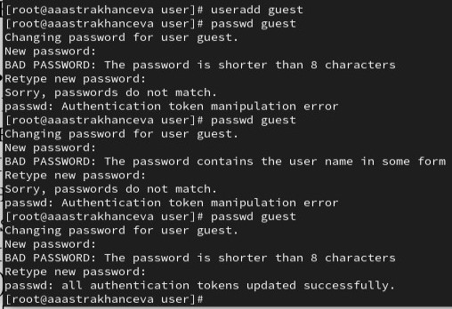
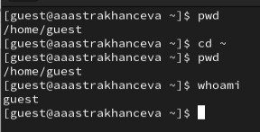
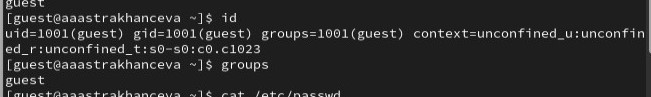
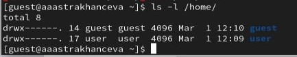
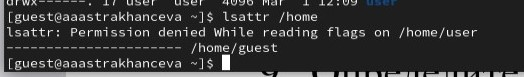
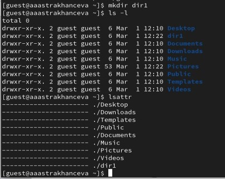
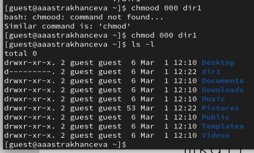
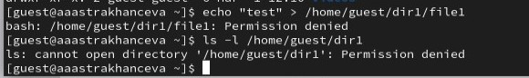

---
## Front matter
lang: ru-RU
title: Лабораторная работа №2
subtitle: Основы информационной безопастности
author:
  - Астраханцева А. А.
institute:
  - Российский университет дружбы народов, Москва, Россия

date: 1 марта 2024

## i18n babel
babel-lang: russian
babel-otherlangs: english

## Formatting pdf
toc: false
toc-title: Содержание
slide_level: 2
aspectratio: 169
section-titles: true
theme: metropolis
header-includes:
 - \metroset{progressbar=frametitle,sectionpage=progressbar,numbering=fraction}
 - '\makeatletter'
 - '\beamer@ignorenonframefalse'
 - '\makeatother'
---

## Докладчик

:::::::::::::: {.columns align=center}
::: {.column width="70%"}

  * Астраханцева Анастасия Александровна
  * студентка НКАбд-01-22
  * Студ. билет: 1132226437
  * Российский университет дружбы народов
  * <https://anastasiia7205.github.io/>

:::
::: {.column width="50%"}

:::
::::::::::::::

## Цель работы

Получение практических навыков работы в консоли с атрибутами фай-
лов, закрепление теоретических основ дискреционного разграничения до-
ступа в современных системах с открытым кодом на базе ОС Linux.

# Выполнение лабораторной работы

## Создание новой учетной записи

1. Создаем учётную запись пользователя guest.

{#fig:001 width=50%}

## Вход в новую учетную запись

2. Входим в систему от имени пользователя guest.

{#fig:002 width=70%}

## Переход в домашний каталог, уточнение имени пользователя

3. Определяем директорию, в которой находимся. Уточняем имя пользователя командой `whoami`.

{#fig:003 width=70%}

## Вывод имени пользователя, его группы и т. д.

4. Уточняем имя пользователя, его группу, а также группы, куда входит пользователь, командой `id`. Сравниваем вывод `id` с выводом команды `groups`. 

{#fig:004 width=70%}

## Просмотр файла /etc/passwd

5. Просматриваем файл /etc/passwd  Сравниваем выводы команды `id`, `groups` и содержимое данного файла.

{#fig:005 width=70%}

## Просмотр поддиректорий home

6. Определяем существующие в системе директории командой `ls -l /home/`.

{#fig:006 width=70%}

## Просмотр атрибутов

7. Проверяем, какие расширенные атрибуты установлены на поддиректориях, находящихся в директории /home.

{#fig:007 width=70%}

## Создание новой дирректории и просмотр прав доступа на нее

8. Создаем в домашней директории поддиректорию dir1 командой mkdir dir1. 

{#fig:008 width=50%}

## Создание новой дирректории и просмотр прав доступа на нее

9. Снимаем с директории dir1 все атрибуты и проверяем результат выполнения.

{#fig:009 width=70%}

## [Попытка создать файл в директори со снятыми атрибутами парв доступа

10. Попытаемся создать в директории dir1 файл file1. 

{#fig:010 width=70%}

## Выводы

В ходе выполнения данной лабораторной работы я получила практические навыки работы в консоли с атрибутами файлов, закрепила теоретические основы дискреционного разграничения доступа в современных системах с открытым кодом на базе ОС Linux.

# Спасибо за внимание

