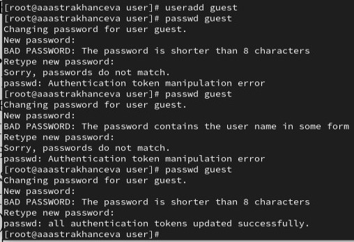
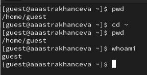
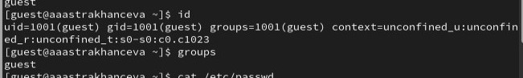
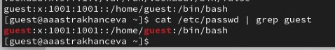
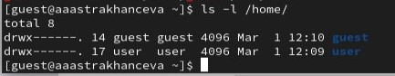
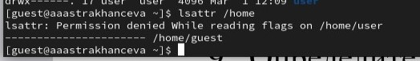
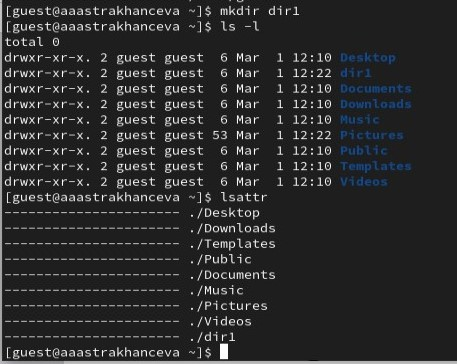
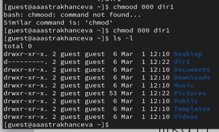
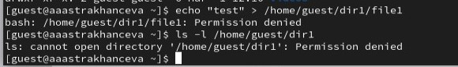

---
## Front matter
title: "Лабораторная работа №2"
subtitle: "Дисциплина: основы информационной безопастности"
author: "Астраханцева А. А."

## Generic otions
lang: ru-RU
toc-title: "Содержание"

## Bibliography
bibliography: bib/cite.bib
csl: pandoc/csl/gost-r-7-0-5-2008-numeric.csl

## Pdf output format
toc: true # Table of contents
toc-depth: 2
lof: true # List of figures
lot: true # List of tables
fontsize: 12pt
linestretch: 1.5
papersize: a4
documentclass: scrreprt
## I18n polyglossia
polyglossia-lang:
  name: russian
  options:
	- spelling=modern
	- babelshorthands=true
polyglossia-otherlangs:
  name: english
## I18n babel
babel-lang: russian
babel-otherlangs: english
## Fonts
mainfont: PT Serif
romanfont: PT Serif
sansfont: PT Sans
monofont: PT Mono
mainfontoptions: Ligatures=TeX
romanfontoptions: Ligatures=TeX
sansfontoptions: Ligatures=TeX,Scale=MatchLowercase
monofontoptions: Scale=MatchLowercase,Scale=0.9
## Biblatex
biblatex: true
biblio-style: "gost-numeric"
biblatexoptions:
  - parentracker=true
  - backend=biber
  - hyperref=auto
  - language=auto
  - autolang=other*
  - citestyle=gost-numeric
## Pandoc-crossref LaTeX customization
figureTitle: "Рис."
tableTitle: "Таблица"
listingTitle: "Листинг"
lofTitle: "Список иллюстраций"
lotTitle: "Список таблиц"
lolTitle: "Листинги"
## Misc options
indent: true
header-includes:
  - \usepackage{indentfirst}
  - \usepackage{float} # keep figures where there are in the text
  - \floatplacement{figure}{H} # keep figures where there are in the text
---

# Цель работы

Получение практических навыков работы в консоли с атрибутами фай-
лов, закрепление теоретических основ дискреционного разграничения до-
ступа в современных системах с открытым кодом на базе ОС Linux.

# Задание

1. Выполнить все задания из списка
2. Составить 2 таблицы по правам доступа

# Теоретическое введение

Права доступа определяют, какие действия конкретный пользователь может или не может совершать с определенным файлами и каталогами. [1]
Есть 3 вида разрешений. Они определяют права пользователя на 3 действия: чтение, запись и выполнение. В Linux эти действия обозначаются вот так:

   1. r — read (чтение) — право просматривать содержимое файла;
   2. w — write (запись) — право изменять содержимое файла;
   3. x — execute (выполнение) — право запускать файл, если это программа или скрипт.

У каждого файла есть 3 группы пользователей, для которых можно устанавливать права доступа. 

   1. owner (владелец) — отдельный человек, который владеет файлом. Обычно это тот, кто создал файл, но владельцем можно сделать и кого-то другого.
   2. group (группа) — пользователи с общими заданными правами.
   3. others (другие) — все остальные пользователи, не относящиеся к группе и не являющиеся владельцами. 
   
   Инструкция по выполнению лабораторной работы была взята с портала ТУИС [2].

# Выполнение лабораторной работы

1. В установленной при выполнении предыдущей лабораторной работы
операционной системе создаем учётную запись пользователя guest (рис. [-@fig:001]).

{#fig:001 width=70%}

2. Входим в систему от имени пользователя guest (рис. [-@fig:002]).

{#fig:002 width=70%}

3. Определяем директорию, в которой находимся, командой `pwd`. Срав-
ниваем её с приглашением командной строки. Определяем, является ли она домашней директорией с помощью `cd ~` (переход в корневой каталог), и снова вводим `pwd`? Уточняем имя пользователя командой `whoami` (рис. [-@fig:003]).

{#fig:003 width=70%}

4. Уточняем имя пользователя, его группу, а также группы, куда вхо-
дит пользователь, командой `id`. Сравниваем вывод `id` с выводом команды `groups` (рис. [-@fig:004]). 

{#fig:004 width=70%}

5. Просматриваем файл /etc/passwd командой
`cat /etc/passwd | grep guest`. Находим в нём свою учётную запись. Сравниваем выводы команды `id`, `groups` и содержимое данного файла. Видим, что uid и git пользователя везде совпадают (рис. [-@fig:005]).

{#fig:005 width=70%}

6. Определяем существующие в системе директории командой `ls -l /home/`.Нам удается получить список поддиректорий директории /home. В нем содержатся директории 'guest' и 'user'. Для обоих дирректорий установлены такие права: 'drwx------'. Это говорит нам о том, что перед нами дирректории (первая буква 'd'), и для этих директорий владлец (owner) единстенный имеет права на чтение, запить и выполнение данных диекторий (рис. [-@fig:006]).

{#fig:006 width=70%}

7. Проверяем, какие расширенные атрибуты установлены на поддиректориях, находящихся в директории /home, командой:
`lsattr /home`. Нам не удается ни увидеть расширенные атрибуты директории, ни расширенные атрибуты директорий других пользователей  (рис. [-@fig:007]).

{#fig:007 width=70%}

8. Создаем в домашней директории поддиректорию dir1 командой
mkdir dir1. С помощью команд `ls -l` и `lsattr` оперделяем, какие права доступа и расши-
ренные атрибуты были выставлены на директорию dir1. Можем видеть, что для данной диретории выставленные стандартные для данного каталога права [-@fig:008]).

{#fig:008 width=70%}

9. Снимаем с директории dir1 все атрибуты командой `chmod 000 dir1` и проверяем результат с помощью выполнения команды `ls -l` (рис.[-@fig:009]).

{#fig:009 width=70%}

10. Попытаемся создать в директории dir1 файл file1 командой `echo "test" > /home/guest/dir1/file1`. Получеам отказ в выполнении данной команды, так как на предыдущем шаге мы снали все атрибуты с данной директории, таким образом теперь никакой пользователь не может ни прочичтать файл, ни изменить его, ни запучтить на выполнение до тех пор, пока права доступа не будут снова изменены рис.[-@fig:010]).

{#fig:010 width=70%}

## Заполнение таблицы 2.1

| | | | | | | | | | |
|-|-|-|-|-|-|-|-|-|-|
|Права директории|Права  файла|Создание  файла|Удаление  файла|Запись  в файл|Чтение  файла|Смена  директории|Просмотр файлов в  директории|Переимено- вание файла|Смена  атрибутов  файла|
|d(000)|(000)| -| -| -| -| -| -| -| -|
|d(000)|(100)| -| -| -| -| -| -| -| -|
|d(000)|(200)| -| -| -| -| -| -| -| -|
|d(000)|(300)| -| -| -| -| -| -| -| -|
|d(000)|(400)| -| -| -| -| -| -| -| -|
|d(000)|(500)| -| -| -| -| -| -| -| -|
|d(000)|(600)| -| -| -| -| -| -| -| -|
|d(000)|(700)| -| -| -| -| -| -| -| -|
|d(100)|(000)| -| -| -| -|+| -| -|+|
|d(100)|(100)| -| -| -| -|+| -| -|+|
|d(100)|(200)| -| -|+| -|+| -| -|+|
|d(100)|(300)| -| -|+| -|+| -| -|+|
|d(100)|(400)| -| -|-|+|+| -| -|+|
|d(100)|(500)| -| -|-|+|+| -| -|+|
|d(100)|(600)| -| -|+|+|+| -| -|+|
|d(100)|(700)| -| -|+|+|+| -| -|+|
|d(200)|(000)| -| -|-|-|-| -| -|-|
|d(200)|(100)| -| -|-|-|-| -| -|-|
|d(200)|(200)| -| -|-|-|-| -| -|-|
|d(200)|(300)| -| -|-|-|-| -| -|-|
|d(200)|(400)| -| -|-|-|-| -| -|-|
|d(200)|(500)| -| -|-|-|-| -| -|-|
|d(200)|(600)| -| -|-|-|-| -| -|-|
|d(200)|(700)| -| -|-|-|-| -| -|-|
|d(300)|(000)|+|+|-|-|+| -|+|+|
|d(300)|(100)|+|+|-|-|+| -|+|+|
|d(300)|(200)|+|+|+|-|+| -|+|+|
|d(300)|(300)|+|+|+|-|+| -|+|+|
|d(300)|(400)|+|+|-|+|+| -|+|+|
|d(300)|(500)|+|+|-|+|+| -|+|+|
|d(300)|(600)|+|+|+|+|+| -|+|+|
|d(300)|(700)|+|+|+|+|+| -|+|+|
|d(400)|(000)|-|-|-|-|-|+|-|-|
|d(400)|(100)|-|-|-|-|-|+|-|-|
|d(400)|(200)|-|-|-|-|-|+|-|-|
|d(400)|(300)|-|-|-|-|-|+|-|-|
|d(400)|(400)|-|-|-|-|-|+|-|-|
|d(400)|(500)|-|-|-|-|-|+|-|-|
|d(400)|(600)|-|-|-|-|-|+|-|-|
|d(400)|(700)|-|-|-|-|-|+|-|-|
|d(500)|(000)|-|-|-|-|+|+|-|+|
|d(500)|(100)|-|-|-|-|+|+|-|+|
|d(500)|(200)|-|-|+|-|+|+|-|+|
|d(500)|(300)|-|-|+|-|+|+|-|+|
|d(500)|(400)|-|-|-|+|+|+|-|+|
|d(500)|(500)|-|-|-|+|+|+|-|+|
|d(500)|(600)|-|-|+|+|+|+|-|+|
|d(500)|(700)|-|-|+|+|+|+|-|+|
|d(600)|(000)|-|-|-|-|-|+|-|-|
|d(600)|(100)|-|-|-|-|-|+|-|-|
|d(600)|(200)|-|-|-|-|-|+|-|-|
|d(600)|(300)|-|-|-|-|-|+|-|-|
|d(600)|(400)|-|-|-|-|-|+|-|-|
|d(600)|(500)|-|-|-|-|-|+|-|-|
|d(600)|(600)|-|-|-|-|-|+|-|-|
|d(600)|(700)|-|-|-|-|-|+|-|-|
|d(700)|(000)|+|+|-|-|+|+|+|+|
|d(700)|(100)|+|+|-|-|+|+|+|+|
|d(700)|(200)|+|+|+|-|+|+|+|+|
|d(700)|(300)|+|+|+|-|+|+|+|+|
|d(700)|(400)|+|+|-|+|+|+|+|+|
|d(700)|(500)|+|+|-|+|+|+|+|+|
|d(700)|(600)|+|+|+|+|+|+|+|+|
|d(700)|(700)|+|+|+|+|+|+|+|+|

Таблица 2.1 «Установленные права и разрешённые действия»

## Заполнение таблицы 2.2

| | | | | |
|-|-|-|-|-|
|Операция| |Минимальные  права на  директорию| |Минимальные  права на файл|
|Создание файла| |d(300)| |-|
|Удаление файла| |d(300)| |-|
|Чтение файла| |d(100)| |(400)|
|Запись в файл| |d(100)| |(200)|
|Переименование файла| |d(300)| |(000)|
|Создание поддиректории| |d(300)| |-|
|Удаление поддиректории| |d(300)| |-|

Таблица 2.2 "Минимальные права для совершения операций"

# Выводы

В ходе выполнения данной лабораторной работы я получила практические навыки работы в консоли с атрибутами файлов, закрепила теоретические основы дискреционного разграничения доступа в современных системах с открытым кодом на базе ОС Linux.

# Список литературы. Библиография

[1] Права доступа в Linux: https://codechick.io/tutorials/unix-linux/unix-linux-permissions
[2] Курс "Основы информационой бесопастности": https://esystem.rudn.ru/course/view.php?id=21204
