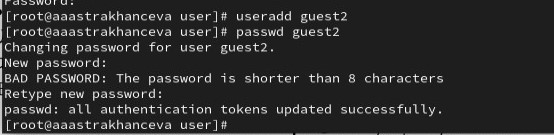
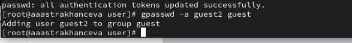
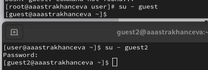
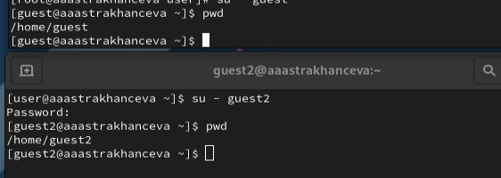
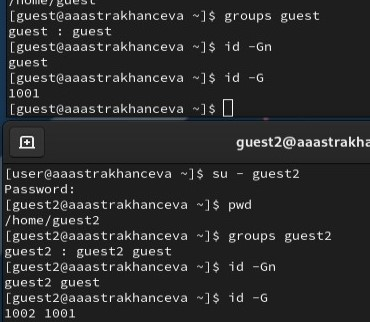
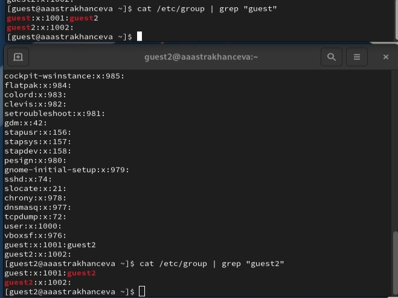
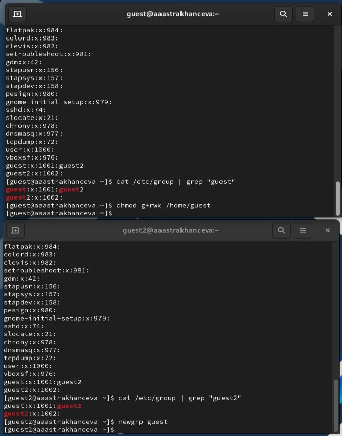
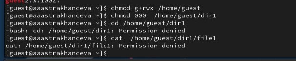

---
## Front matter
lang: ru-RU
title: Лабораторная работа №3
subtitle: Основы информационной безопастности
author:
  - Астраханцева А. А.
institute:
  - Российский университет дружбы народов, Москва, Россия

date: 13 марта 2024

## i18n babel
babel-lang: russian
babel-otherlangs: english

## Formatting pdf
toc: false
toc-title: Содержание
slide_level: 2
aspectratio: 169
section-titles: true
theme: metropolis
header-includes:
 - \metroset{progressbar=frametitle,sectionpage=progressbar,numbering=fraction}
 - '\makeatletter'
 - '\beamer@ignorenonframefalse'
 - '\makeatother'
---

## Докладчик

:::::::::::::: {.columns align=center}
::: {.column width="70%"}

  * Астраханцева Анастасия Александровна
  * студентка НКАбд-01-22
  * Студ. билет: 1132226437
  * Российский университет дружбы народов
  * <https://anastasiia7205.github.io/>

:::
::: {.column width="50%"}

:::
::::::::::::::

## Цель работы

Получение практических навыков работы в консоли с атрибутами фай-
лов для групп пользователей.

# Выполнение лабораторной работы

## Создание новой учетной записи

1. Cоздаем учётную запись пользователя guest2, (guest создали в прошлой лабораторной)

{#fig:001 width=70%}

## Добавление guest2 в группу guest

2. Добавляем пользователя guest2 в группу guest

{#fig:002 width=70%}

## Вход в систему от двух пользователей

3. Осуществялем вход в систему от двух пользователей на двух разных консолях: guest на первой консоли и guest2 на второй консоли

{#fig:003 width=70%}

## Определение дирректорию для каждого из пользователей

4. Определяем дирректорию для каждого из пользователей и сравниваем ее с приглашениями командной строки

{#fig:004 width=70%}

## Имя пользователя, его группу, кто входит в неё и т. д.

5. Уточняем имя пользователя, его группу, кто входит в неё и к каким группам принадлежит он сам. 

{#fig:005 width=50%}

## Содержимое файла /etc/group

6. Сравниваем полученную информацию с содержимым файла /etc/group

{#fig:006 width=50%}

## Регистрация пользователя guest2 в группе guest

7. От имени пользователя guest2 выполняем регистрацию пользователя guest2 в группе guest

{#fig:007 width=70%}

## Изменение права директории /home/guest

8. От имени пользователя guest изменяем права директории /home/guest, разрешив все действия для пользователей группы. От имени пользователя guest снимаем с директории /home/guest/dir1 все атрибуты

{#fig:008 width=70%}

## Выводы

В ходе выполнения данной лабораторной работы я получила практические навыки работы в консоли с атрибутами файлов для групп пользователей.

# Спасибо за внимание

