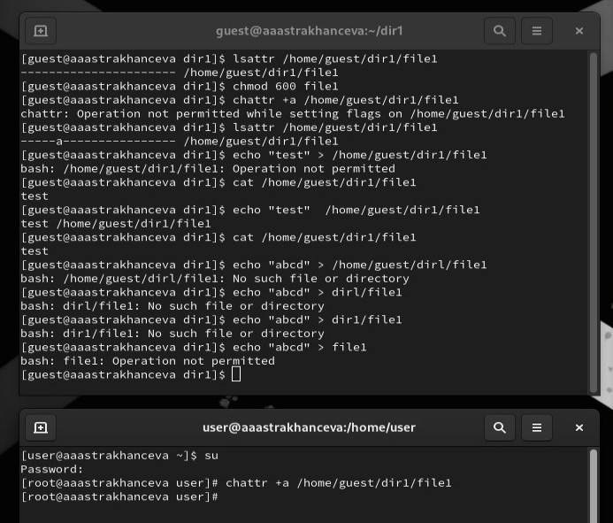
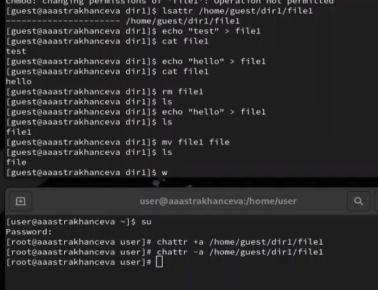
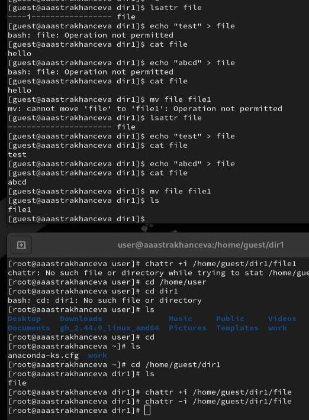

---
## Front matter
lang: ru-RU
title: Лабораторная работа №4
subtitle: Основы информационной безопастности
author:
  - Астраханцева А. А.
institute:
  - Российский университет дружбы народов, Москва, Россия

date: 28 марта 2024

## i18n babel
babel-lang: russian
babel-otherlangs: english

## Formatting pdf
toc: false
toc-title: Содержание
slide_level: 2
aspectratio: 169
section-titles: true
theme: metropolis
header-includes:
 - \metroset{progressbar=frametitle,sectionpage=progressbar,numbering=fraction}
 - '\makeatletter'
 - '\beamer@ignorenonframefalse'
 - '\makeatother'
---

## Докладчик

:::::::::::::: {.columns align=center}
::: {.column width="70%"}

  * Астраханцева Анастасия Александровна
  * студентка НКАбд-01-22
  * Студ. билет: 1132226437
  * Российский университет дружбы народов
  * <https://anastasiia7205.github.io/>

:::
::: {.column width="50%"}

:::
::::::::::::::

## Цель работы

Получение практических навыков работы в консоли с расширенными
атрибутами файлов.

# Выполнение лабораторной работы

## Работа с расширенными атрибутами файла

:::::::::::::: {.columns align=center}
::: {.column width="20%"}

 a - файл может быть открыт только в режиме добавления;

:::
::: {.column width="75%"}

{width=70%}

:::
::::::::::::::

## Работа с расширенными атрибутами файла

:::::::::::::: {.columns align=center}
::: {.column width="20%"}

Снимем расширенный атрибут a с файла /home/guest/dirl/file1 от имени суперпользователя

:::
::: {.column width="75%"}

{width=70%}

:::
::::::::::::::

## Работа с расширенными атрибутами файла

:::::::::::::: {.columns align=center}
::: {.column width="20%"}

 Далее полвторим действия по шагам, заменив атрибут «a» атрибутом «i».

:::
::: {.column width="75%"}

{width=70%}

:::
::::::::::::::

## Выводы

В результате выполнения работы я повысила свои навыки использования интерфейса командой строки (CLI), познакомилась на примерах с тем, как используются основные и расширенные атрибуты при разграничении доступа. Имела возможность связать теорию дискреционного разделения доступа (дискреционная политика безопасности) с её реализацией на практике в ОС Linux. 

# Спасибо за внимание

