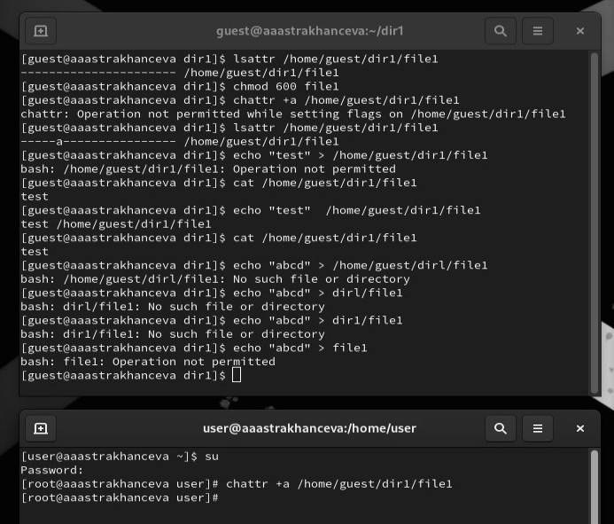
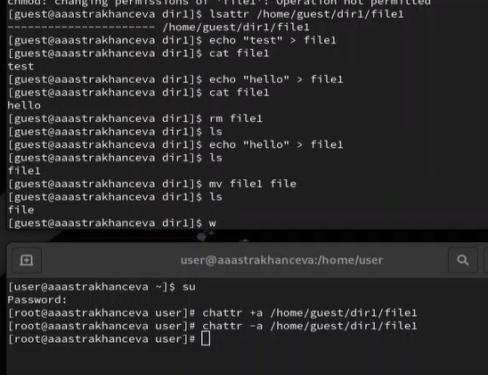
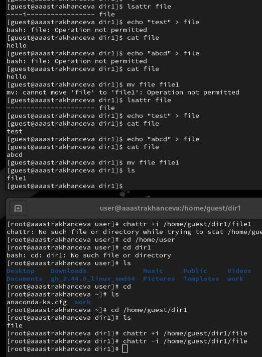

---
## Front matter
title: "Лабораторная работа №4"
subtitle: "Дисциплина: основы информационной безопастности"
author: "Астраханцева А. А."

## Generic otions
lang: ru-RU
toc-title: "Содержание"

## Bibliography
bibliography: bib/cite.bib
csl: pandoc/csl/gost-r-7-0-5-2008-numeric.csl

## Pdf output format
toc: true # Table of contents
toc-depth: 2
lof: true # List of figures
lot: true # List of tables
fontsize: 12pt
linestretch: 1.5
papersize: a4
documentclass: scrreprt
## I18n polyglossia
polyglossia-lang:
  name: russian
  options:
	- spelling=modern
	- babelshorthands=true
polyglossia-otherlangs:
  name: english
## I18n babel
babel-lang: russian
babel-otherlangs: english
## Fonts
mainfont: PT Serif
romanfont: PT Serif
sansfont: PT Sans
monofont: PT Mono
mainfontoptions: Ligatures=TeX
romanfontoptions: Ligatures=TeX
sansfontoptions: Ligatures=TeX,Scale=MatchLowercase
monofontoptions: Scale=MatchLowercase,Scale=0.9
## Biblatex
biblatex: true
biblio-style: "gost-numeric"
biblatexoptions:
  - parentracker=true
  - backend=biber
  - hyperref=auto
  - language=auto
  - autolang=other*
  - citestyle=gost-numeric
## Pandoc-crossref LaTeX customization
figureTitle: "Рис."
tableTitle: "Таблица"
listingTitle: "Листинг"
lofTitle: "Список иллюстраций"
lotTitle: "Список таблиц"
lolTitle: "Листинги"
## Misc options
indent: true
header-includes:
  - \usepackage{indentfirst}
  - \usepackage{float} # keep figures where there are in the text
  - \floatplacement{figure}{H} # keep figures where there are in the text
---

# Цель работы

Получение практических навыков работы в консоли с расширенными
атрибутами файлов.

# Теоретическое введение 

Один из подходов к разграничению доступа — так называемый дискреционный (от англ, discretion — чье-либо усмотрение) — предполагает назначение владельцев объектов, которые по собственному усмотрению определяют права доступа субъектов (других пользователей) к объектам (файлам), которыми владеют.

Дискреционные механизмы разграничения доступа используются для разграничения прав доступа процессов как обычных пользователей, так и для ограничения прав системных программ в (например, служб операционной системы), которые работают от лица псевдопользовательских учетных записей [1].

Утилита chattr позволяет устанавливать и отключать атрибуты файлов, на уровне файловой системы не зависимо от стандартных (чтение, запись, выполнение). Для просмотра текущих аттрибутов можно использовать lsattr. Изначально атрибуты управляемые chattr и lsattr поддерживались только файловыми системами семейства ext (ext2,ext3,ext4). но теперь эта возможность доступна и в других популярных файловых системах таких как XFS, Btrfs, ReiserFS, и т д.

Базовый синтаксис chattr выглядит следующим образом:

$ chattr опции [оператор][атрибуты] файлы

Вот основные опции утилиты, которые вы можете использовать:

   1. -R - рекурсивная обработка каталога;
   2. -V - максимально подробный вывод;
   3. -f - игнорировать сообщения об ошибках;
   4. -v - вывести версию.

Оператор может принимать значения:

    + - включить выбранные атрибуты;
    - - отключить выбранные атрибуты;
    = - оставить значение атрибута таким, каким оно было у файла.

Вот некоторые доступные атрибуты:

   1. a - файл может быть открыт только в режиме добавления;
   2. A - не обновлять время перезаписи;
   3. c - автоматически сжимать при записи на диск;
   4. C - отключить копирование при записи;
   5. D - работает только для папки, когда установлен, все изменения синхронно записываются на диск сразу же;
   6. e - использовать extent'ы блоков для хранения файла;
   7. i - сделать неизменяемым;
   8. j - все данные перед записью в файл будут записаны в журнал;
   9. s - безопасное удаление с последующей перезаписью нулями;
   10. S - синхронное обновление, изменения файлов с этим атрибутом будут сразу же записаны на диск;
   11. t - файлы с этим атрибутом не будут хранится в отдельных блоках;
   12. u - содержимое файлов с этим атрибутом не будет удалено при удалении самого файла и потом может быть восстановлено. [2]

# Выполнение лабораторной работы

1. От имени пользователя guest определяем расширенные атрибуты файла с помощью команды `lsattr /home/guest/dir1/file1` (верхнее окно терминала).

2. Командой
`chmod 600 file1` устанавливаем на файл file1 права, разрешающие чтение и запись для владельца файла (верхнее окно терминала).

3. При попытке установить на файл /home/guest/dir1/file1 расширенный атрибут a от имени пользователя guest командой `chattr +a /home/guest/dir1/file1` получаем отказ на выполнение операции (верхнее окно терминала).

4. Зайдем на другую консоль с правами администратора с помощью команды `su`. Установим расширенный атрибут `a` на файл /home/guest/dir1/file1 от имени суперпользователя с помощью команды: `chattr +a /home/guest/dir1/file1` (нижнее окно терминала).

5. От пользователя guest проверим правильность установления атрибута командой: `lsattr /home/guest/dir1/file1` (верхнее окно терминала).

6. Выполним дозапись в файл file1 слова «test» командой `echo "test" > /home/guest/dir1/file1` и получим отказ. После этого выполним чтение файла file1 командой: `cat /home/guest/dir1/file1` (верхнее окно терминала). 

7. Попробуем изменить сожержимое файла file1, запсав в него "abcd" с помошью команды `echo "abcd" /home/guest/dir1/file1`. Получим отказ при попытке выполнить коамнду (верхнее окно терминала) (рис. [-@fig:001]).

{#fig:001 width=70%}

8. Снимем расширенный атрибут a с файла /home/guest/dirl/file1 от имени суперпользователя командой: `chattr -a /home/guest/dir1/file1` (нижнее окно терминала), и повторим операции, которые делали до этого. Попробуем записать слово "hello" в файл file1 командой: `echo "hello" > /home/guest/dir1/file1`. После этого проверим првильность выполнения операции с помощью команды: `cat /home/guest/dir1/file1` (верхнее окно терминала). Попробуем переименовать фалй и удалить его  (рис. [-@fig:002]).

{#fig:002 width=70%}

9. Далее полвторим действия по шагам, заменив атрибут «a» атрибутом «i» (рис. [-@fig:003]).

{#fig:003 width=70%}

# Выводы

В результате выполнения работы я повысила свои навыки использования интерфейса командой строки (CLI), познакомилась на примерах с тем, как используются основные и расширенные атрибуты при разграничении доступа. Имела возможность связать теорию дискреционного разделения доступа (дискреционная политика безопасности) с её реализацией на практике в ОС Linux. 

# Список литературы. Библиография

[1] искреционное разграничение доступа Linux: https://debianinstall.ru/diskretsionnoe-razgranichenie-dostupa-linux/

[2] Команда chattr в Linux: https://losst.pro/neizmenyaemye-fajly-v-linux

