---
## Front matter
lang: ru-RU
title: Лабораторная работа №4
subtitle: Основы информационной безопастности
author:
  - Астраханцева А. А.
institute:
  - Российский университет дружбы народов, Москва, Россия

date: 13 апреля 2024

## i18n babel
babel-lang: russian
babel-otherlangs: english

## Formatting pdf
toc: false
toc-title: Содержание
slide_level: 2
aspectratio: 169
section-titles: true
theme: metropolis
header-includes:
 - \metroset{progressbar=frametitle,sectionpage=progressbar,numbering=fraction}
 - '\makeatletter'
 - '\beamer@ignorenonframefalse'
 - '\makeatother'
---

## Докладчик

:::::::::::::: {.columns align=center}
::: {.column width="70%"}

  * Астраханцева Анастасия Александровна
  * студентка НКАбд-01-22
  * Студ. билет: 1132226437
  * Российский университет дружбы народов
  * <https://anastasiia7205.github.io/>

:::
::: {.column width="50%"}

:::
::::::::::::::

## Цель работы

Изучение механизмов изменения идентификаторов, применения SetUID- и Sticky-битов. Получение практических навыков работы в консоли с дополнительными атрибутами. Рассмотрение работы механизма смены идентификатора процессов пользователей, а также влияние бита Sticky на запись и удаление файлов.

# Выполнение лабораторной работы

## Подготовка лабораторного стенда

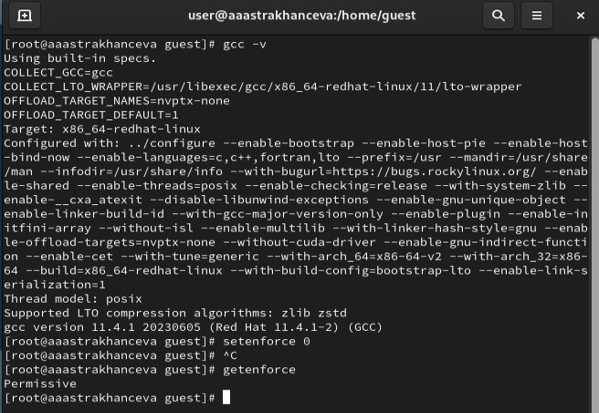{#fig:001 width=70%}

## Создание программыы simpleid.c

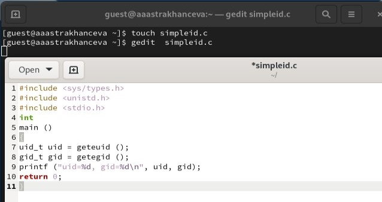{#fig:002 width=70%}

## Компиляция программыы simpleid.c

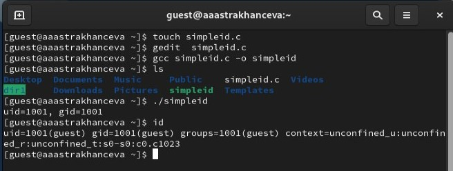{#fig:003 width=70%}

## Создание программыы simpleid2.c

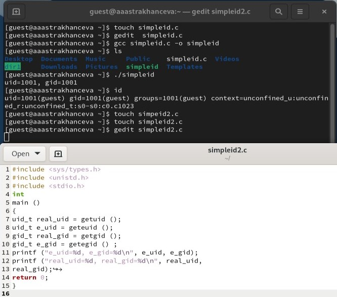{#fig:004 width=70%}

## Компиляция программыы simpleid2.c

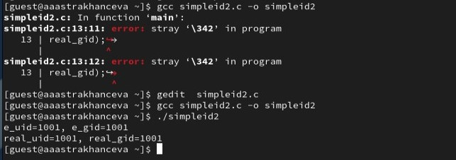{#fig:005 width=70%}

## Запуск программыы simpleid2.c

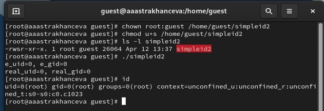{#fig:006 width=70%}

## Создание программыы readfile.c

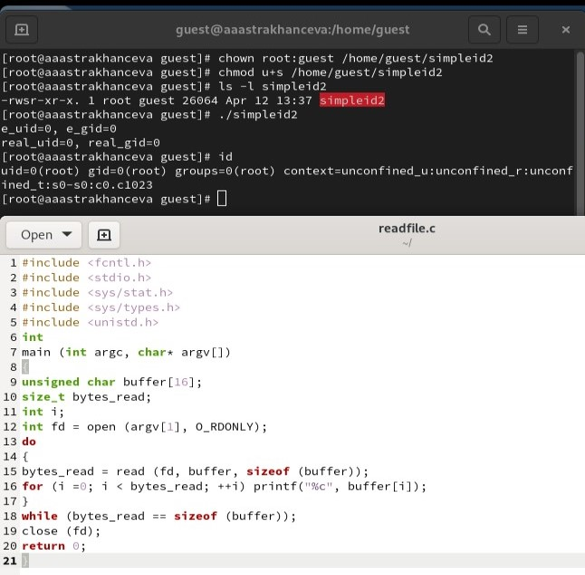{#fig:007 width=70%}

## Компиляция и запуск программыы readfile.c

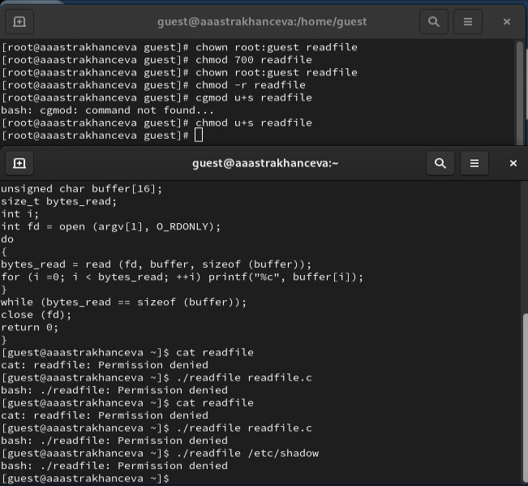{#fig:008 width=70%}

## Исследование Sticky-бита

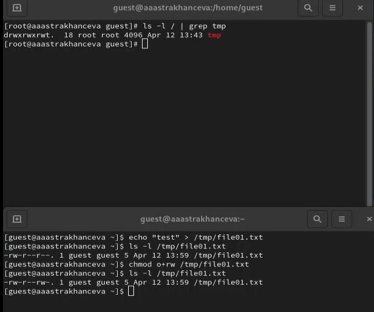{#fig:009 width=70%}

## Исследование Sticky-бита

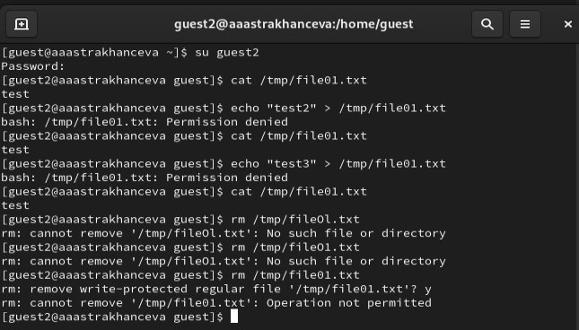{#fig:010 width=70%}

## Исследование Sticky-бита

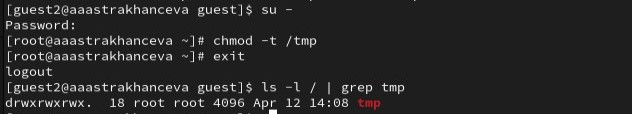{#fig:011 width=70%}

## Исследование Sticky-бита

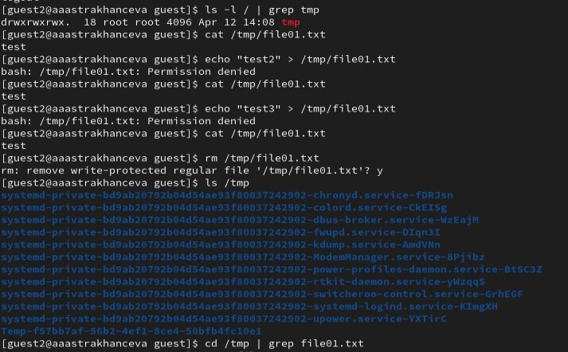{#fig:012 width=70%}

## Выводы

В ходе выполнения лабораторной рабоыт я изучила механизмы изменения идентификаторов, применения SetUID- и Sticky-битов. Также получила практические навыки работы в консоли с дополнительными атрибутами, рассмотрела работы механизма смены идентификатора процессов пользователей, а также влияние бита Sticky на запись и удаление файлов.

# Спасибо за внимание

