---
## Front matter
title: "Лабораторная работа №5"
subtitle: "Дисциплина: основы информационной безопастности"
author: "Астраханцева А. А."

## Generic otions
lang: ru-RU
toc-title: "Содержание"

## Bibliography
bibliography: bib/cite.bib
csl: pandoc/csl/gost-r-7-0-5-2008-numeric.csl

## Pdf output format
toc: true # Table of contents
toc-depth: 2
lof: true # List of figures
lot: true # List of tables
fontsize: 12pt
linestretch: 1.5
papersize: a4
documentclass: scrreprt
## I18n polyglossia
polyglossia-lang:
  name: russian
  options:
	- spelling=modern
	- babelshorthands=true
polyglossia-otherlangs:
  name: english
## I18n babel
babel-lang: russian
babel-otherlangs: english
## Fonts
mainfont: PT Serif
romanfont: PT Serif
sansfont: PT Sans
monofont: PT Mono
mainfontoptions: Ligatures=TeX
romanfontoptions: Ligatures=TeX
sansfontoptions: Ligatures=TeX,Scale=MatchLowercase
monofontoptions: Scale=MatchLowercase,Scale=0.9
## Biblatex
biblatex: true
biblio-style: "gost-numeric"
biblatexoptions:
  - parentracker=true
  - backend=biber
  - hyperref=auto
  - language=auto
  - autolang=other*
  - citestyle=gost-numeric
## Pandoc-crossref LaTeX customization
figureTitle: "Рис."
tableTitle: "Таблица"
listingTitle: "Листинг"
lofTitle: "Список иллюстраций"
lotTitle: "Список таблиц"
lolTitle: "Листинги"
## Misc options
indent: true
header-includes:
  - \usepackage{indentfirst}
  - \usepackage{float} # keep figures where there are in the text
  - \floatplacement{figure}{H} # keep figures where there are in the text
---


# Цель работы

Изучение механизмов изменения идентификаторов, применения SetUID- и Sticky-битов. Получение практических навыков работы в консоли с дополнительными атрибутами. Рассмотрение работы механизма смены идентификатора процессов пользователей, а также влияние бита Sticky на запись и удаление файлов.

# Теоретическое введение 

**SetUID**

Бит доступа SETUID дает возможность запускать файл на исполнение от имени владельца файла. Например, именно так работает программа sudo. Если мы посмотрим на нее через ls, то увидим что вместо ключа x стоит ключ s. Это и означает, что у данного файла включен или выставлен параметр SETUID. А значит, если обычный пользователь запустит этот файл, то файл будет запущен от имени владельца, то есть root. Важно понимать, что никакого ввода пароля при этом не потребуется. А сам запрос и обработка пароля организованы уже внутри программы sudo [1].

**Sticky bit**

Это разрешение полезно для защиты файлов от случайного удаления в среде, где несколько пользователей имеют права на запись в один и тот же каталог. Если применяется закрепленный sticky bit, пользователь может удалить файл, только если он является пользователем-владельцем файла или каталога, в котором содержится файл. По этой причине он применяется в качестве разрешения по умолчанию для каталога /tmp и может быть полезен также для каталогов общих групп.

Без sticky bit, если пользователь может создавать файлы в каталоге, он также может удалять файлы из этого каталога. В общедоступной групповой среде это может раздражать. Представьте себе пользователей linda и lori, которые оба имеют права на запись в каталог /data/account и получают эти разрешения благодаря участию в группе account. Поэтому linda может удалять файлы, созданные lori, и наоборот.

Когда вы применяете sticky bit, пользователь может удалять файлы, только если выполняется одно из следующих условий:

    Пользователь является владельцем файла;
    Пользователь является владельцем каталога, в котором находится файл.


При использовании ls -ld, вы можете видеть sticky bit как t в позиции, где вы обычно видите разрешение на выполнение для других [2].


# Выполнение лабораторной работы

## Подготовка лабораторного стенда

Проверяем, установлен ли у нас компилятор qcc командой `gcc -v`.

Отключаем систему запретов до очередной перезагрузки системы командой `setenforce 0`. После этого команда `getenforce` должна выводить Permissive (рис. [-@fig:001])

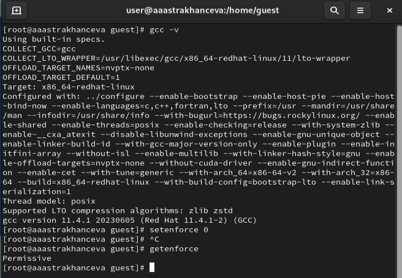{#fig:001 width=70%}

## Создание программы

1. Войдите в систему от имени пользователя guest.

2. Создайте программу simpleid.c: (рис. [-@fig:002])
```
#include <sys/types.h>
#include <unistd.h>
#include <stdio.h>
int
main ()
{
uid_t uid = geteuid ();
gid_t gid = getegid ();
printf ("uid=%d, gid=%d\n", uid, gid);
return 0;
}
```
	
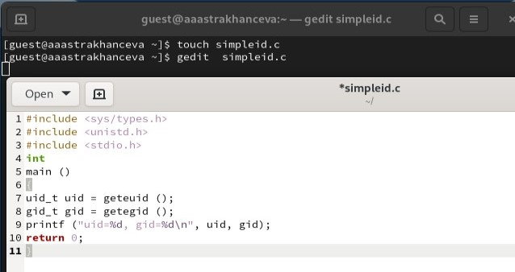{#fig:002 width=70%}

3. Скомплилируйте программу и убедитесь, что файл программы создан: `gcc simpleid.c -o simpleid`

4. Выполните программу simpleid: `./simpleid`

5. Выполните системную программу id: `id` и сравните полученный вами результат с данными предыдущего пункта задания. Выводы команд совпали (рис. [-@fig:003]).

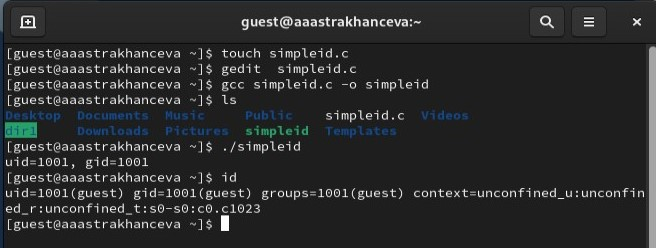{#fig:003 width=70%}

6. Усложните программу, добавив вывод действительных идентификаторов:
``` 
#include <sys/types.h>
#include <unistd.h>
#include <stdio.h>
int
main ()
{
uid_t real_uid = getuid ();
uid_t e_uid = geteuid ();
gid_t real_gid = getgid ();
gid_t e_gid = getegid () ;
printf ("e_uid=%d, e_gid=%d\n", e_uid, e_gid);
printf ("real_uid=%d, real_gid=%d\n", real_uid,
real_gid);
return 0;
}
```
Получившуюся программу назовите simpleid2.c. (рис. [-@fig:004]).

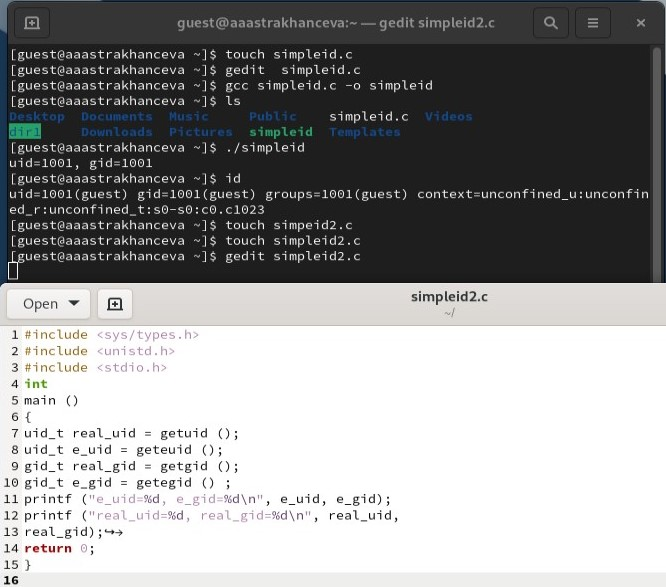{#fig:004 width=70%}

7. Скомпилируйте и запустите simpleid2.c: `gcc simpleid2.c -o simpleid2`, `./simpleid2` (рис. [-@fig:005]).

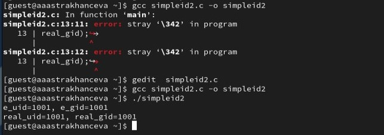{#fig:005 width=70%}

8. От имени суперпользователя выполните команды: `chown root:guest /home/guest/simpleid2`, `chmod u+s /home/guest/simpleid2`

9. Используйте sudo или повысьте временно свои права с помощью su.
Поясните, что делают эти команды. Первая команда меняет владельца файла simpleid2.c, а вторая устанавливает на этот файл SetUID бит. 

10. Выполните проверку правильности установки новых атрибутов и смены
владельца файла simpleid2: `ls -l simpleid2`

11. Запустите simpleid2 и id: `./simpleid2`, `id`
Сравните результаты.  (рис. [-@fig:006]).

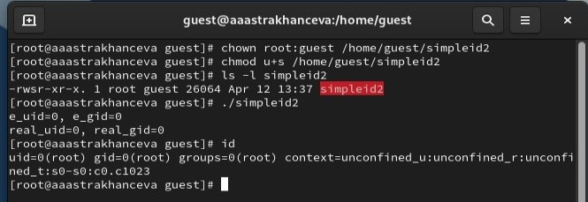{#fig:006 width=70%}


12. Создайте программу readfile.c: (рис. [-@fig:007]).
```
#include <fcntl.h>
#include <stdio.h>
#include <sys/stat.h>
#include <sys/types.h>
#include <unistd.h>
int
main (int argc, char* argv[])
{
unsigned char buffer[16];
size_t bytes_read;
int i;
int fd = open (argv[1], O_RDONLY);
do
{
bytes_read = read (fd, buffer, sizeof (buffer));
for (i =0; i < bytes_read; ++i) printf("%c", buffer[i]);
}
while (bytes_read == sizeof (buffer));
close (fd);
return 0;
}
```

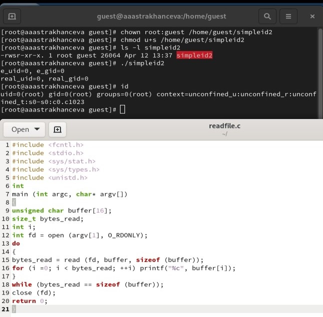{#fig:007 width=70%}

14. Откомпилируйте её. `gcc readfile.c -o readfile`

15. Смените владельца у файла readfile.c (или любого другого текстового файла в системе) и измените права так, чтобы только суперпользователь (root) мог прочитать его, a guest не мог.

16. Проверьте, что пользователь guest не может прочитать файл readfile.c.

17. Смените у программы readfile владельца и установите SetU’D-бит.

18. Проверьте, может ли программа readfile прочитать файл readfile.c?

19. Проверьте, может ли программа readfile прочитать файл /etc/shadow? (рис. [-@fig:008]).

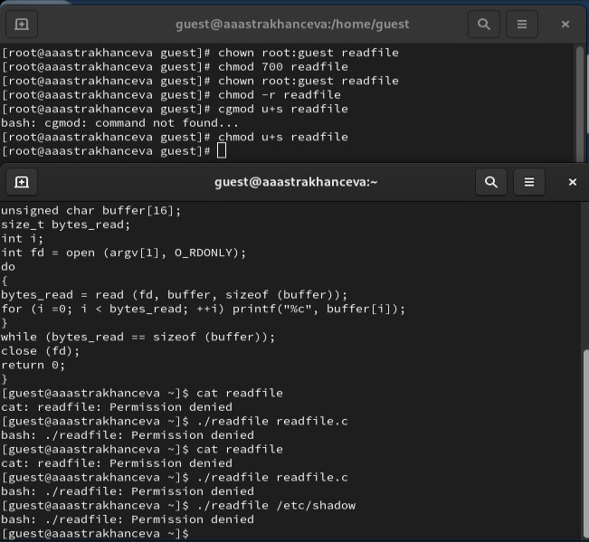{#fig:008 width=70%}

## Исследование Sticky-бита

1. Выясните, установлен ли атрибут Sticky на директории /tmp, для чего выполните команду `ls -l / | grep tmp`

2. От имени пользователя guest создайте файл file01.txt в директории /tmp со словом test: `echo "test" > /tmp/file01.txt`

3. Просмотрите атрибуты у только что созданного файла и разрешите чтение и запись для категории пользователей «все остальные»: `ls -l /tmp/file01.txt`, `chmod o+rw /tmp/file01.txt`, `ls -l /tmp/file01.txt` (рис. [-@fig:009]).

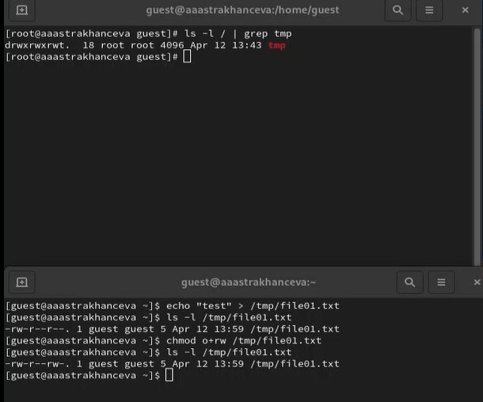{#fig:009 width=70%}

4. От пользователя guest2 (не являющегося владельцем) попробуйте прочитать файл /tmp/file01.txt: `cat /tmp/file01.txt`

5. От пользователя guest2 попробуйте дозаписать в файл /tmp/file01.txt слово test2 командой `echo "test2" > /tmp/file01.txt`. Удалось ли вам выполнить операцию?

6. Проверьте содержимое файла командой `cat /tmp/file01.txt`

7. От пользователя guest2 попробуйте записать в файл /tmp/file01.txt слово test3, стерев при этом всю имеющуюся в файле информацию командой `echo "test3" > /tmp/file01.txt`. Удалось ли вам выполнить операцию?

8. Проверьте содержимое файла командой `cat /tmp/file01.txt`

9. От пользователя guest2 попробуйте удалить файл /tmp/file01.txt командой `rm /tmp/fileOl.txt`. Удалось ли вам удалить файл? (рис. [-@fig:010]).

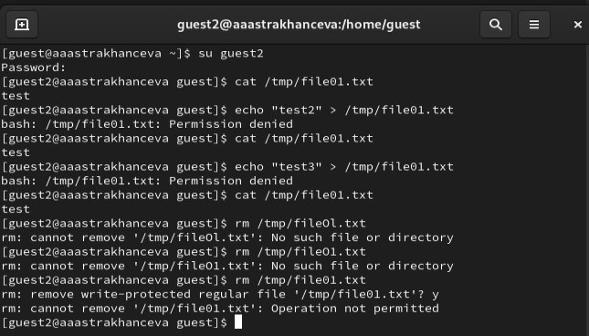{#fig:010 width=70%}

10. Повысьте свои права до суперпользователя следующей командой `su -` и выполните после этого команду, снимающую атрибут t (Sticky-бит) с директории /tmp: `chmod -t /tmp`

11. Покиньте режим суперпользователя командой `exit`

12. От пользователя guest2 проверьте, что атрибута t у директории /tmp нет: `ls -l / | grep tmp` (рис. [-@fig:011]).

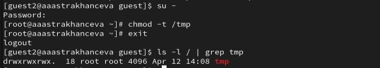{#fig:011 width=70%}

13. Повторите предыдущие шаги. Какие наблюдаются изменения?

14. Удалось ли вам удалить файл от имени пользователя, не являющегося его владельцем? Ваши наблюдения занесите в отчёт. Внести изменения в файл не удалось, зато получиось его удалить.

15. Повысьте свои права до суперпользователя и верните атрибут t на директорию /tmp: su - chmod +t /tmp exit (рис. [-@fig:012]).

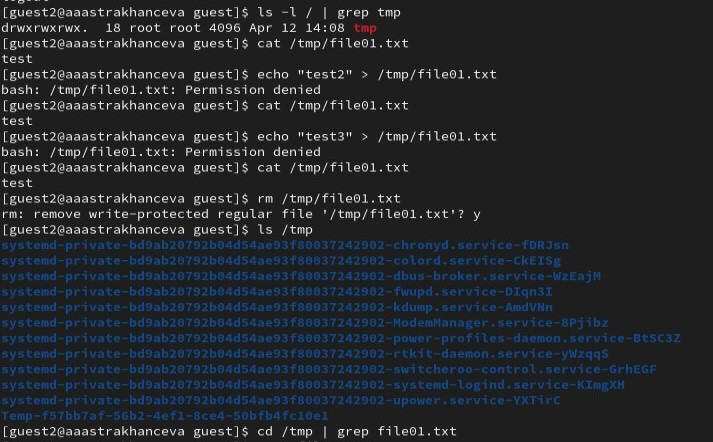{#fig:012 width=70%}


# Выводы

В ходе выполнения лабораторной рабоыт я изучила механизмы изменения идентификаторов, применения SetUID- и Sticky-битов. Также получила практические навыки работы в консоли с дополнительными атрибутами, рассмотрела работы механизма смены идентификатора процессов пользователей, а также влияние бита Sticky на запись и удаление файлов.

# Список литературы. Библиография

[1] Права доступа на файлы. Часть 3. Специальные биты разрешений SETUID, SETGID и Sticky bit: https://dzen.ru/a/Y-S4apsOlAJ73hJe

[2] Права в Linux (chown, chmod, SUID, GUID, sticky bit, ACL, umask): https://habr.com/ru/articles/469667/

