---
## Front matter
lang: ru-RU
title: Лабораторная работа №6
subtitle: Основы информационной безопастности
author:
  - Астраханцева А. А.
institute:
  - Российский университет дружбы народов, Москва, Россия

date: 27 апреля 2024

## i18n babel
babel-lang: russian
babel-otherlangs: english

## Formatting pdf
toc: false
toc-title: Содержание
slide_level: 2
aspectratio: 169
section-titles: true
theme: metropolis
header-includes:
 - \metroset{progressbar=frametitle,sectionpage=progressbar,numbering=fraction}
 - '\makeatletter'
 - '\beamer@ignorenonframefalse'
 - '\makeatother'
---

## Докладчик

:::::::::::::: {.columns align=center}
::: {.column width="70%"}

  * Астраханцева Анастасия Александровна
  * студентка НКАбд-01-22
  * Студ. билет: 1132226437
  * Российский университет дружбы народов
  * <https://anastasiia7205.github.io/>

:::
::: {.column width="50%"}

:::
::::::::::::::

## Цель работы

Развить навыки администрирования ОС Linux. Получить первое практическое знакомство с технологией SELinux1.
Проверить работу SELinx на практике совместно с веб-сервером Apache.

# Выполнение лабораторной работы

## Проверка работы SELinux

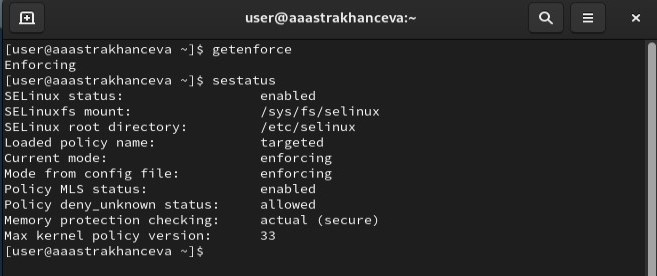{#fig:001 width=70%}

## Проверка работы веб-сервера
	
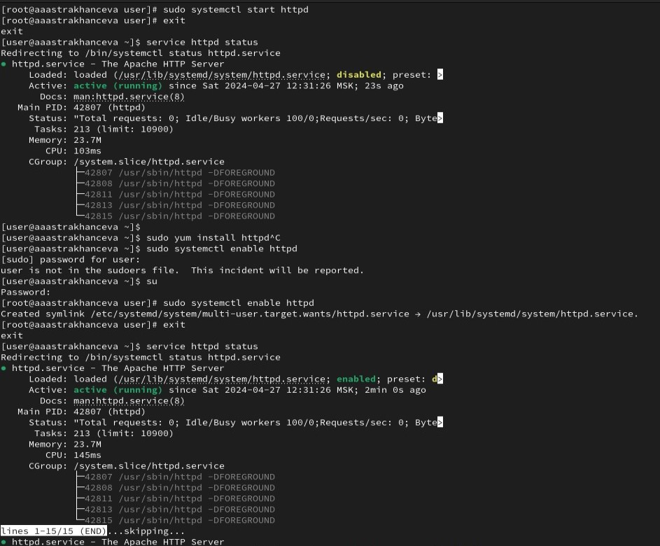{#fig:002 width=70%}

## Контекст безопасности веб-сервера Apache

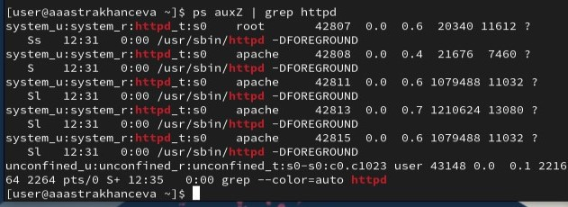{#fig:003 width=70%}

## Текущее состояние переключателей SELinux для Apache

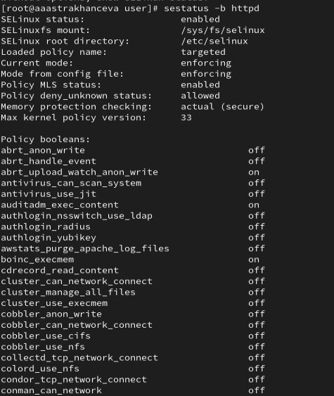{#fig:004 width=70%}

## Статистика по политике

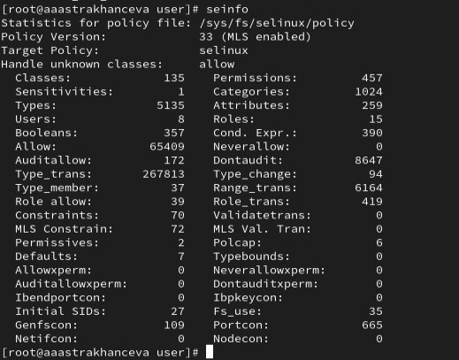{#fig:005 width=70%}

## Типы файлов в дирректриях /var/www и /var/www/html

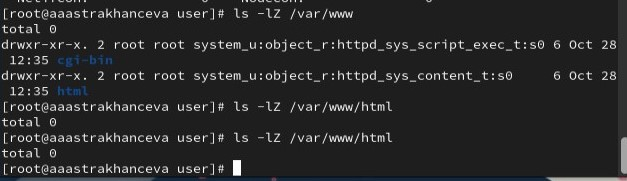{#fig:006 width=70%}

## Создание html-файла

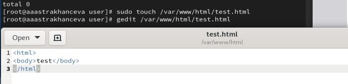{#fig:007 width=70%}

## Контекст файла /var/www/html

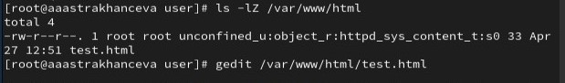{#fig:008 width=70%}

## Файл /var/www/html

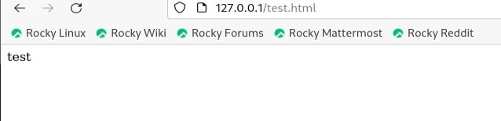{#fig:009 width=70%}

## Изменение контекста файла /var/www/html/test.html

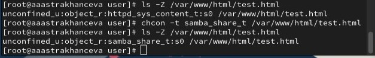{#fig:010 width=70%}

## Сообщение об ошибке

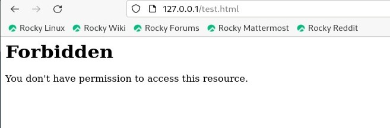{#fig:011 width=70%}

## Просмотр log-файлов

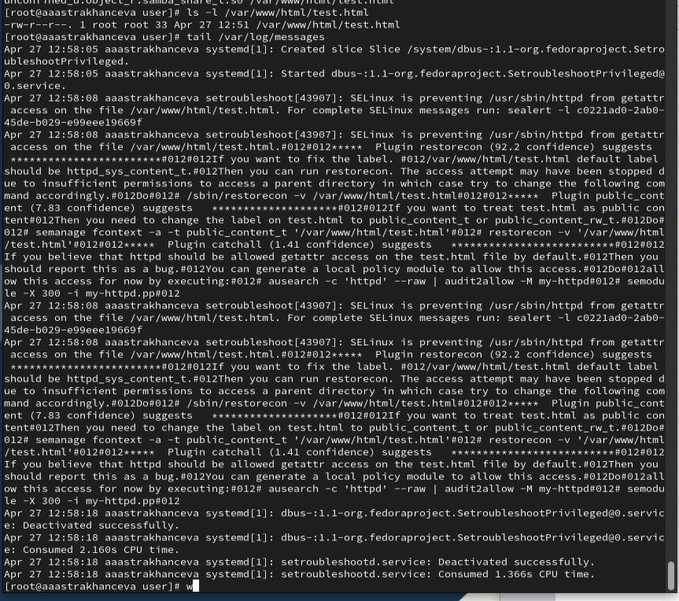{#fig:012 width=70%}

## Просмотр log-файлов

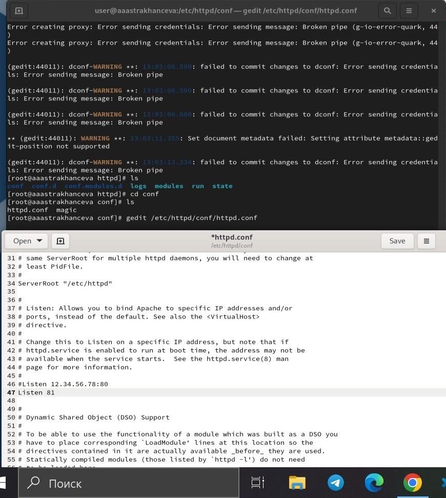{#fig:013 width=70%}

## Просмотр файлов /var/log/messages, /var/log/http/error_log

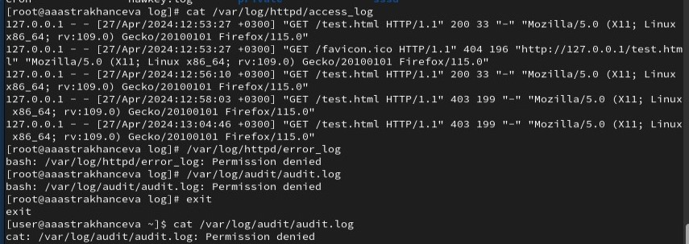{#fig:014 width=70%}

## Добавление порта 81

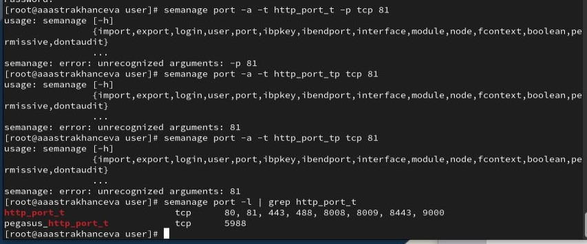{#fig:015 width=70%}

## Зпапуск веб-сервера Apache

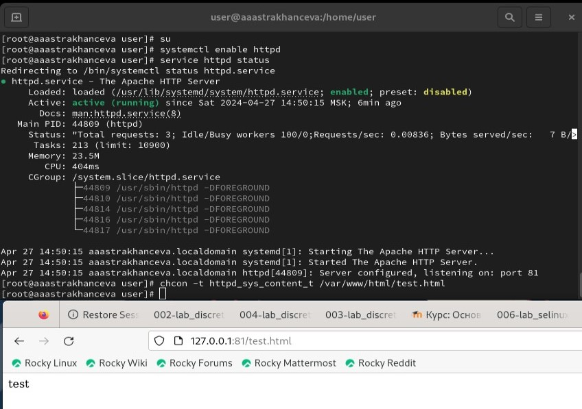{#fig:016 width=70%}

## Исправление конфигурационного файла apache

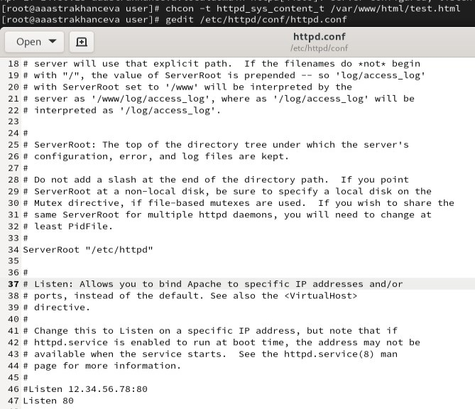{#fig:017 width=70%}

## Удаление привзяки к порту 81 и файла /var/www/html/test.html:

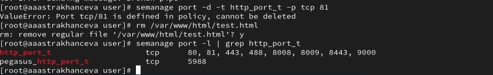{#fig:018 width=70%}

## Выводы

В ходе выполения ЛР№6 я развила навыки администрирования ОС Linux. Получила первое практическое знакомство с технологией SELinux1. Прверила работу SELinx на практике совместно с веб-сервером Apache.

# Спасибо за внимание

