---
## Front matter
title: "Лабораторная работа №6"
subtitle: "Дисциплина: основы информационной безопастности"
author: "Астраханцева А. А."

## Generic otions
lang: ru-RU
toc-title: "Содержание"

## Bibliography
bibliography: bib/cite.bib
csl: pandoc/csl/gost-r-7-0-5-2008-numeric.csl

## Pdf output format
toc: true # Table of contents
toc-depth: 2
lof: true # List of figures
lot: true # List of tables
fontsize: 12pt
linestretch: 1.5
papersize: a4
documentclass: scrreprt
## I18n polyglossia
polyglossia-lang:
  name: russian
  options:
	- spelling=modern
	- babelshorthands=true
polyglossia-otherlangs:
  name: english
## I18n babel
babel-lang: russian
babel-otherlangs: english
## Fonts
mainfont: PT Serif
romanfont: PT Serif
sansfont: PT Sans
monofont: PT Mono
mainfontoptions: Ligatures=TeX
romanfontoptions: Ligatures=TeX
sansfontoptions: Ligatures=TeX,Scale=MatchLowercase
monofontoptions: Scale=MatchLowercase,Scale=0.9
## Biblatex
biblatex: true
biblio-style: "gost-numeric"
biblatexoptions:
  - parentracker=true
  - backend=biber
  - hyperref=auto
  - language=auto
  - autolang=other*
  - citestyle=gost-numeric
## Pandoc-crossref LaTeX customization
figureTitle: "Рис."
tableTitle: "Таблица"
listingTitle: "Листинг"
lofTitle: "Список иллюстраций"
lotTitle: "Список таблиц"
lolTitle: "Листинги"
## Misc options
indent: true
header-includes:
  - \usepackage{indentfirst}
  - \usepackage{float} # keep figures where there are in the text
  - \floatplacement{figure}{H} # keep figures where there are in the text
---

# Цель работы

Развить навыки администрирования ОС Linux. Получить первое практическое знакомство с технологией SELinux1.
Проверить работу SELinx на практике совместно с веб-сервером Apache.

# Теоретическое введение 

SELinux (Security-Enhanced Linux) обеспечивает усиление защиты путем внесения изменений как на уровне ядра, так и на уровне пространства пользователя, что превращает ее в действительно «непробиваемую» операционную систему [1].

Apache ― это программное обеспечение с открытым исходным кодом, которое позволяет создавать веб-сервер.

Веб-сервер — это программа, без которой не может работать сайт в интернете. Cайт — это набор файлов, например, HTML, CSS и JS. В каждом файле находится информация о картинках, тексте, кнопках, шрифтах и других элементах внешнего вида сайта. Все эти файлы находятся на физическом сервере, который имеет или арендует владелец сайта. Чтобы показать пользователю сайт, браузер должен связаться с сервером и получить эти файлы. Для связи с сервером браузер просит помощи у веб-сервера. Веб-сервер получает запрос от браузера, ищет ресурсы сайта и пересылает их ему. Только после этого браузер показывает контент пользователю.

Apache состоит из ядра и модулей. Ядро выполняет основные функции: обработка конфигурационных файлов, работа с протоколом HTTP, система загрузки модулей. Оно может работать самостоятельно без модулей, но тогда функционал программы будет крайне ограничен. Ядро создала команда компании Apache Software Foundation без вмешательства сторонних разработчиков. [2].

# Выполнение лабораторной работы

Войдите в систему с полученными учётными данными и убедитесь, что SELinux работает в режиме enforcing политики targeted с помощью команд getenforce и sestatus. (рис. [-@fig:001])

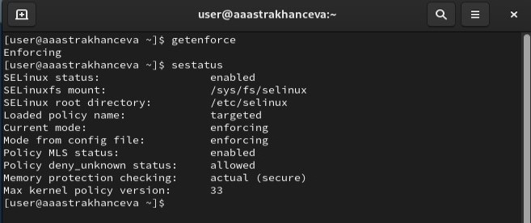{#fig:001 width=70%}

Обратитесь с помощью браузера к веб-серверу, запущенному на вашем компьютере, и убедитесь, что последний работает: service httpd status: (рис. [-@fig:002])

	
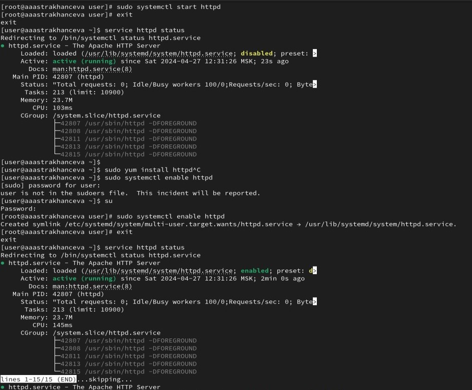{#fig:002 width=70%}

Найдите веб-сервер Apache в списке процессов, определите его контекст безопасности и занесите эту информацию в отчёт (рис. [-@fig:003]).

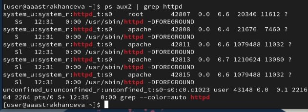{#fig:003 width=70%}

Посмотрите текущее состояние переключателей SELinux для Apache с помощью команды sestatus -b httpd. (рис. [-@fig:004]).

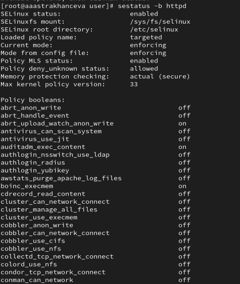{#fig:004 width=70%}

Посмотрите статистику по политике с помощью команды seinfo, также определите множество пользователей, ролей, типов (рис. [-@fig:005]).

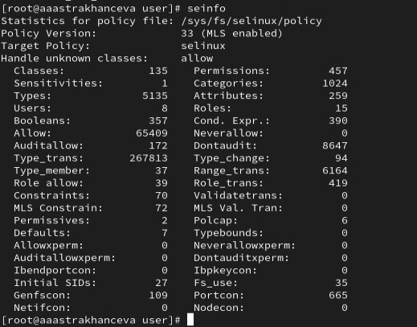{#fig:005 width=70%}

Определите тип файлов и поддиректорий, находящихся в директории /var/www, с помощью команды ls -lZ /var/www (2 дирректории). Определите тип файлов, находящихся в директории /var/www/html: ls -lZ /var/www/html (пустая). (рис. [-@fig:006]).

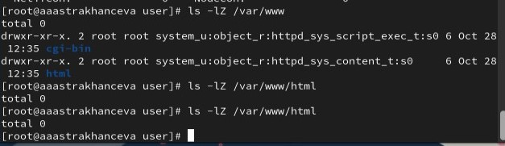{#fig:006 width=70%}

Создайте от имени суперпользователя (так как в дистрибутиве после установки только ему разрешена запись в директорию) html-файл /var/www/html/test.html следующего содержания (рис. [-@fig:007]):
<html>
<body>test</body>
</html>.

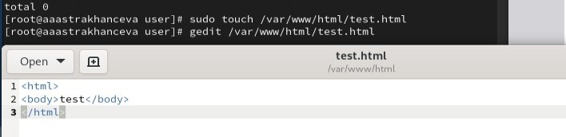{#fig:007 width=70%}

Проверьте контекст созданного вами файла. Занесите в отчёт контекст, присваиваемый по умолчанию вновь созданным файлам в директории /var/www/html. (рис. [-@fig:008]).

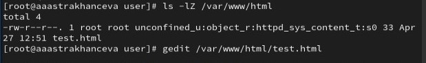{#fig:008 width=70%}

Обратитесь к файлу через веб-сервер, введя в браузере адрес http://127.0.0.1/test.html. Убедитесь, что файл был успешно отображён. (рис. [-@fig:009]).

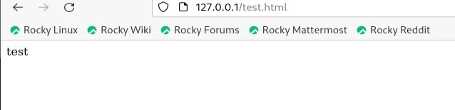{#fig:009 width=70%}

Измените контекст файла /var/www/html/test.html с httpd_sys_content_t на любой другой, к которому процесс httpd не должен иметь доступа, например, на samba_share_t: chcon -t samba_share_t /var/www/html/test.html
ls -Z /var/www/html/test.html. После этого проверьте, что контекст поменялся (рис. [-@fig:010]).

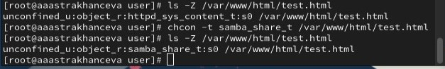{#fig:010 width=70%}

Попробуйте ещё раз получить доступ к файлу через веб-сервер, введя в браузере адрес http://127.0.0.1/test.html. Вы должны получить сообщение об ошибке:
Forbidden
You don't have permission to access /test.html on this server (рис. [-@fig:011]).

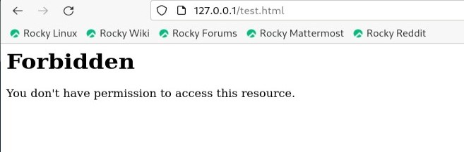{#fig:011 width=70%}

Просмотрите log-файлы веб-сервера Apache. Также просмотрите системный лог-файл: tail /var/log/messages (рис. [-@fig:012]).

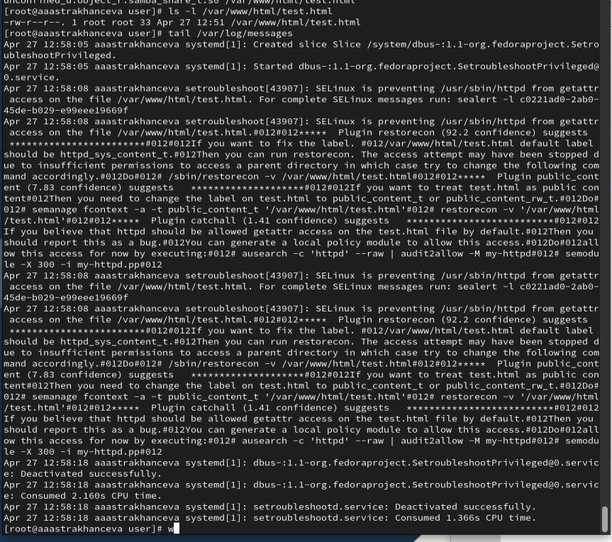{#fig:012 width=70%}

Попробуйте запустить веб-сервер Apache на прослушивание ТСР-порта 81 (а не 80, как рекомендует IANA и прописано в /etc/services). Для этого в файле /etc/httpd/httpd.conf найдите строчку Listen 80 и замените её на Listen 81  (рис. [-@fig:013]).

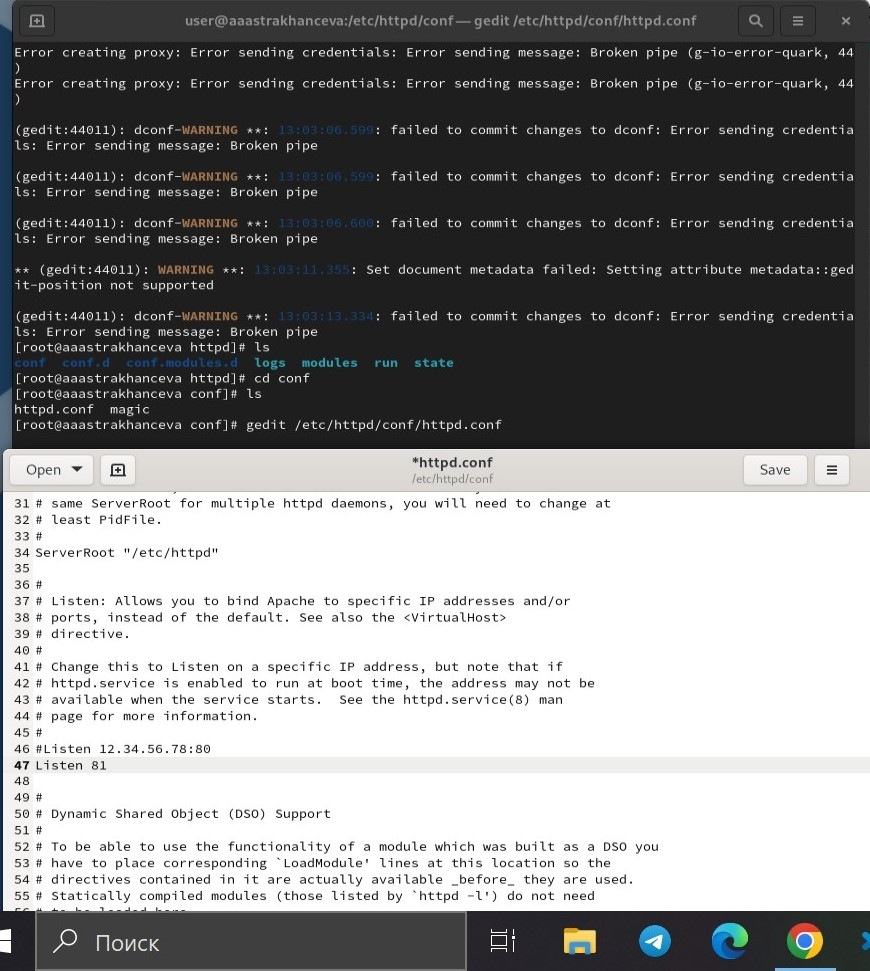{#fig:013 width=70%}

Проанализируйте лог-файлы: tail -nl /var/log/messages Просмотрите файлы /var/log/http/error_log, /var/log/http/access_log и /var/log/audit/audit.log и выясните, в каких файлах появились записи (рис. [-@fig:014]).

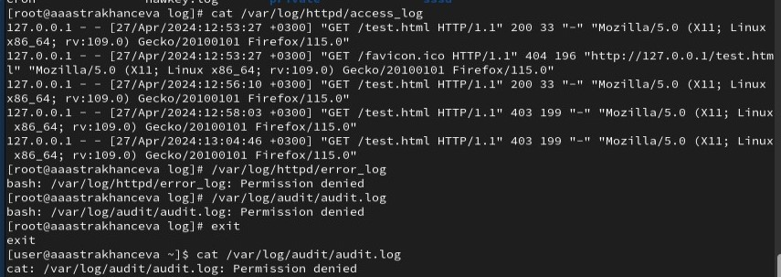{#fig:014 width=70%}

Выполните команду semanage port -a -t http_port_t -р tcp 81. После этого проверьте список портов командой
semanage port -l | grep http_port_t Убедитесь, что порт 81 появился в списке (рис. [-@fig:015]).

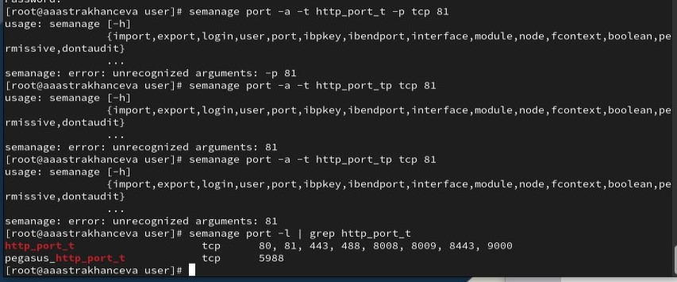{#fig:015 width=70%}

Попробуйте запустить веб-сервер Apache ещё раз. Поняли ли вы, почему он сейчас запустился, а в предыдущем случае не смог? Верните контекст httpd_sys_cоntent_t к файлу /var/www/html/ test.html: chcon -t httpd_sys_content_t /var/www/html/test.html После этого попробуйте получить доступ к файлу через веб-сервер, введя в браузере адрес http://127.0.0.1:81/test.html. Вы должны увидеть содержимое файла — слово «test» (рис. [-@fig:016]).

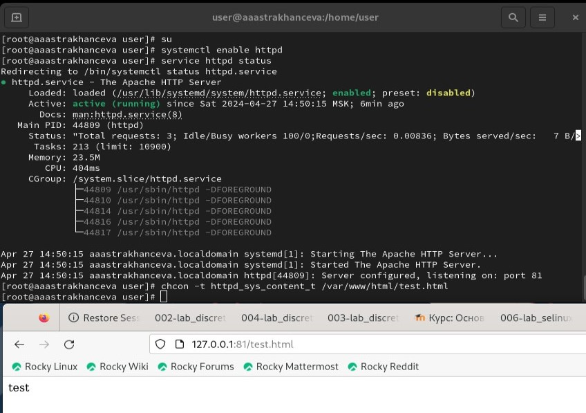{#fig:016 width=70%}

Исправьте обратно конфигурационный файл apache, вернув Listen 80 (рис. [-@fig:017]).

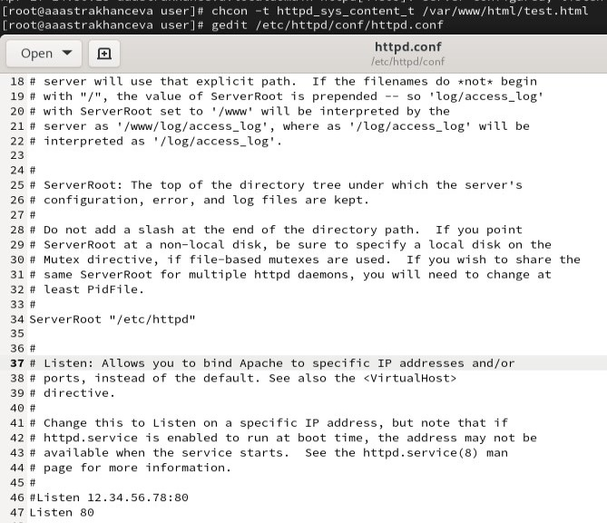{#fig:017 width=70%}

Удалите привязку http_port_t к 81 порту: semanage port -d -t http_port_t -p tcp 81, проверьте, что порт 81 удалён. Удалите файл /var/www/html/test.html: rm /var/www/html/test.html (рис. [-@fig:018])

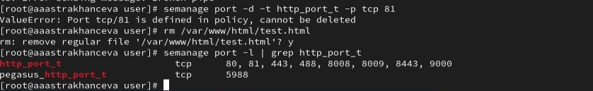{#fig:018 width=70%}

# Выводы

В ходе выполения ЛР№6 я развила навыки администрирования ОС Linux. Получила первое практическое знакомство с технологией SELinux1. Прверила работу SELinx на практике совместно с веб-сервером Apache.

# Список литературы. Библиография

[1] SELinux - система принудительного контроля доступа: https://redos.red-soft.ru/base/manual/safe-redos/selinux/

[2] Права в Linux (chown, chmod, SUID, GUID, sticky bit, ACL, umask): https://habr.com/ru/articles/469667/

