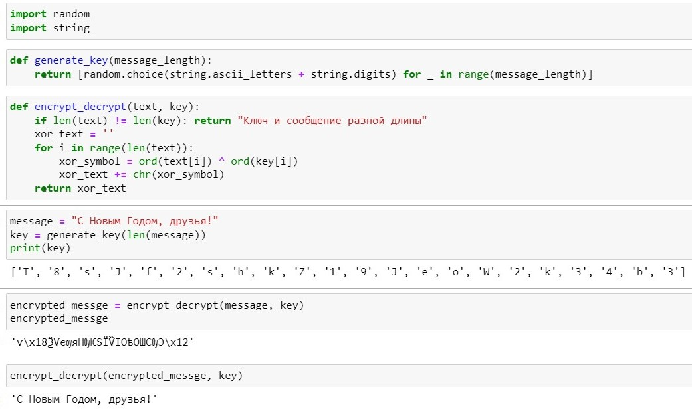

---
## Front matter
title: "Лабораторная работа №7"
subtitle: "Дисциплина: основы информационной безопастности"
author: "Астраханцева А. А."

## Generic otions
lang: ru-RU
toc-title: "Содержание"

## Bibliography
bibliography: bib/cite.bib
csl: pandoc/csl/gost-r-7-0-5-2008-numeric.csl

## Pdf output format
toc: true # Table of contents
toc-depth: 2
lof: true # List of figures
lot: true # List of tables
fontsize: 12pt
linestretch: 1.5
papersize: a4
documentclass: scrreprt
## I18n polyglossia
polyglossia-lang:
  name: russian
  options:
	- spelling=modern
	- babelshorthands=true
polyglossia-otherlangs:
  name: english
## I18n babel
babel-lang: russian
babel-otherlangs: english
## Fonts
mainfont: PT Serif
romanfont: PT Serif
sansfont: PT Sans
monofont: PT Mono
mainfontoptions: Ligatures=TeX
romanfontoptions: Ligatures=TeX
sansfontoptions: Ligatures=TeX,Scale=MatchLowercase
monofontoptions: Scale=MatchLowercase,Scale=0.9
## Biblatex
biblatex: true
biblio-style: "gost-numeric"
biblatexoptions:
  - parentracker=true
  - backend=biber
  - hyperref=auto
  - language=auto
  - autolang=other*
  - citestyle=gost-numeric
## Pandoc-crossref LaTeX customization
figureTitle: "Рис."
tableTitle: "Таблица"
listingTitle: "Листинг"
lofTitle: "Список иллюстраций"
lotTitle: "Список таблиц"
lolTitle: "Листинги"
## Misc options
indent: true
header-includes:
  - \usepackage{indentfirst}
  - \usepackage{float} # keep figures where there are in the text
  - \floatplacement{figure}{H} # keep figures where there are in the text
---

# Цель работы

Освоить на практике применение режима однократного гаммирования.


# Теоретическое введение

Гаммирование представляет собой наложение (снятие) на открытые (зашифрованные) данные последовательности элементов других данных, полученной с помощью некоторого криптографического алгоритма, для получения зашифрованных (открытых) данных. Иными словами, наложение гаммы — это сложение её элементов с элементами открытого (закрытого) текста по некоторому фиксированному модулю, значение которого представляет собой известную часть алгоритма шифрования. В соответствии с теорией криптоанализа, если в методе шифрования используется однократная вероятностная гамма (однократное гаммирование) той же длины, что и подлежащий сокрытию текст, то текст нельзя раскрыть. Даже при раскрытии части последовательности гаммы нельзя получить информацию о всём скрываемом тексте.Наложение гаммы по сути представляет собой выполнение операции сложения по модулю 2 (XOR) (обозначаемая знаком `⊕`) между элементами гаммы и элементами подлежащего сокрытию текста. 

# Выполнение лабораторной работы

Нужно подобрать ключ, чтобы получить сообщение «С Новым Годом, друзья!». Требуется разработать приложение, позволяющее шифровать и дешифровать данные в режиме однократного гаммирования. Приложение должно:

1. Определить вид шифротекста при известном ключе и известном открытом тексте.

2. Определить ключ, с помощью которого шифротекст может быть преобразован в некоторый фрагмент текста, представляющий собой один из возможных вариантов прочтения открытого текста. (рис. [-@fig:001]).

{#fig:001 width=70%}

```python 
import randomimport string

def generate_key(message_length):    
return [random.choice(string.ascii_letters + string.digits) for _ in range(message_length)]

def encrypt_decrypt(text, key):
    if len(text) != len(key): return "Ключ и сообщение разной длины"     
    xor_text = ''
    for i in range(len(text)):  
        xor_symbol = ord(text[i]) ^ ord(key[i])
        xor_text += chr(xor_symbol)    
        return xor_text
        
message = "С Новым Годом, друзья!"
key = generate_key(len(message))print(key)
encrypted_messge = encrypt_decrypt(message, key)
encrypt_decrypt(encrypted_messge, key)

```
Листинг 1. Код приложения

# Контрольные вопросы

1. Поясните смысл однократного гаммирования.

Используется случайный ключ, такой же длины, что и сообщение. Для шифрования каждый символ открытого текста складывается по модулю 2 с соответствующим символом из ключа.

2. Перечислите недостатки однократного гаммирования.

Неудобство в обмене ключами, так как каждый ключ должен быть столь же длинным, как и открытый текст. Один и тот же ключ не должен использоваться более одного раза, иначе это уязвимость.

3. Перечислите преимущества однократного гаммирования.

Так как используется случайный ключ - вероятность подорбать такой же слиишком мала. Простота реализации. 

4. Почему длина открытого текста должна совпадать с длиной ключа?

Потому что шифрование и дешифрование происходит путем применения опрации "сложение по модулю 2" для каждого символа ключа и текста для передачи/зашифорванного текста. Именно поэтому нужно ключ такой же длины.

5. Какая операция используется в режиме однократного гаммирования, назовите её особенности?

Операция XOR (исключающее ИЛИ) используется в режиме однократного гаммирования. Особенностью XOR является то, что результат равен true (1) только в том случае, если только один из операндов равен true (1).

6. Как по открытому тексту и ключу получить шифротекст?

Для получения шифротекста необходимо применить операцию XOR для каждого элемента текста и ключа (попарно).

7. Как по открытому тексту и шифротексту получить ключ?

Для получения ключа необходимо применить операцию XOR для каждого элемента текста и шифротекста (попарно).

8. В чем заключаются необходимые и достаточные условия абсолютной стойкости шифра?

– полная случайность ключа;

– равенство длин ключа и открытого текста;

– однократное использование ключа

# Выводы

В ходе выполнения ЛР№7 я освоила на практике применение режима однократного гаммирования.

# Список литературы{.unnumbered}

1. Курс "Основы инфомационной безопасности"
