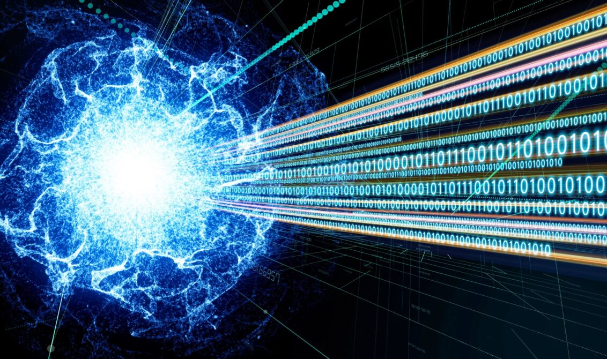
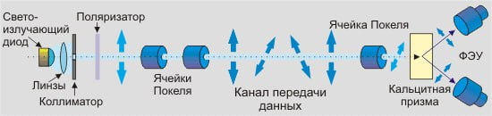
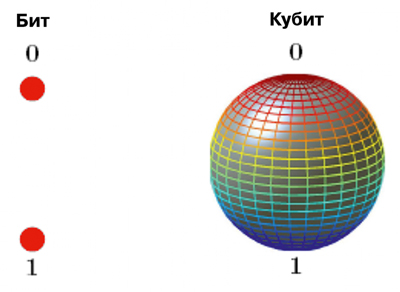
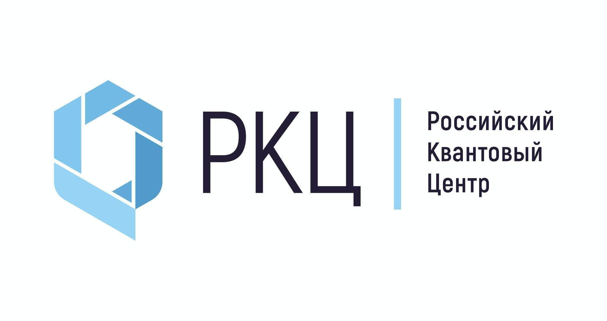
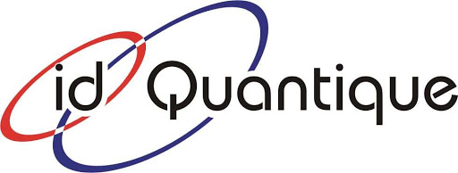

---
## Front matter
lang: ru-RU
title: Квантовое шифрование. Квантовая передача информации
subtitle: Основы информационной безопастности
author:
  - Астраханцева А. А. 
institute:
  - Российский университет дружбы народов, Москва, Россия
  - НКАбд-01-22
  
date: 10 мая 2024

## i18n babel
babel-lang: russian
babel-otherlangs: english

## Formatting pdf
toc: false
toc-title: Содержание
slide_level: 2
aspectratio: 169
section-titles: true
theme: metropolis
header-includes:
 - \metroset{progressbar=frametitle,sectionpage=progressbar,numbering=fraction}
 - '\makeatletter'
 - '\beamer@ignorenonframefalse'
 - '\makeatother'
---

## Введение

:::::::::::::: {.columns align=center}
::: {.column width="70%"}

   - Большое значение в цифровом мире
   - Надежные методы защиты данных
   - Перспективы в криптографии и безопасности
   - Использование квантовых свойств частиц для криптографических протоколов
   - Квантовая передача информации обеспечивает конфиденциальность
   
:::
::: {.column width="60%"}

{#fig:001 width=100%}

:::
::::::::::::::

## Основы квантового шифрования

Квантовая криптография - это метод обеспечения безопасности коммуникаций, использующий принципы квантовой физики. Идея защиты информации с помощью квантовых объектов впервые была предложена в 1970 году Стивеном Визнером, а затем развита Чарльзом Беннетом и Жилем Брассардом, которые создали первый протокол квантовой криптографии (BB84) в 1984 году. 

{#fig:002 width=70% align=center}

## Схема реализации квантовой криптографии 

Слева находится передающая сторона, а справа - принимающая. Свет из светоизлучающего диода направляется на коллиматорю. После коллиматора идут Ячейки Покеля, которые изменяют поляризацию фотонов в системе передачи данных. На принимающей стороне системы устанавливается кальцитовая призма, которая разделяет пучок на два фотодетектора для измерения ортогональных составляющих поляризации. Проблема с интенсивностью импульсов квантов возникает при их формировании, где оптимальное количество квантов в импульсе составляет около единицы для предотвращения перехвата информации. 

{#fig:003 width=80%}

## Квантовая передача информации

:::::::::::::: {.columns align=center}
::: {.column width="60%"}

- Квантовая телепортация - это процесс передачи состояния, а не конкретных объектов или энергии, основанный на квантовых свойствах частиц. Квантовая телепортация использует кубиты, базовые элементы передаваемого состояния, находящиеся в суперпозиции двух состояний. Эффект запутанности позволяет передать уникальные состояния с минимальным количеством информации. 

:::
::: {.column width="50%"}

:::
::::::::::::::

## Практические применения квантового шифрования

:::::::::::::: {.columns align=center}
::: {.column width="60%"}

- Рынок квантовых технологий остается относительно небольшим, где одним из первых игроков стала компания ID Quantique. Тем не менее, компании как ID Quantique, так и российские учреждения, включая Российский Квантовый Центр (РКЦ), активно продвигают квантовые технологии, разрабатывая инновационные системы и проводя успешные эксперименты для обеспечения безопасности данных.

:::
::: {.column width="50%"}

{#fig:004 width=70%}

{#fig:005 width=70%}

:::
::::::::::::::

## Заключение

:::::::::::::: {.columns align=center}
::: {.column width="60%"}

- Квантовая передача информации позволяет создавать сети связи, устойчивые к взлому и помехам, обеспечивая безопасную коммуникацию на глобальном уровне.
- Квантовое шифрование имеет широкие перспективы применения в финансах, государственной безопасности и медицине.
- Дальнейшее развитие квантового шифрования и передачи информации является ключевой задачей для научного и технологического сообщества.
- Новые исследования и инновации в этой области позволят расширить возможности цифровой безопасности и коммуникаций.

:::
::: {.column width="50%"}

{#fig:006 width=70%}

:::
::::::::::::::

# Спасибо за внимание

