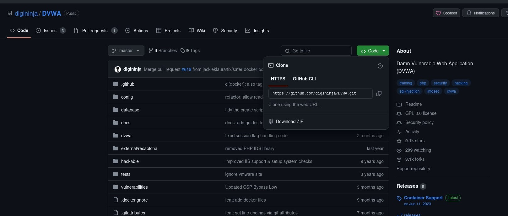
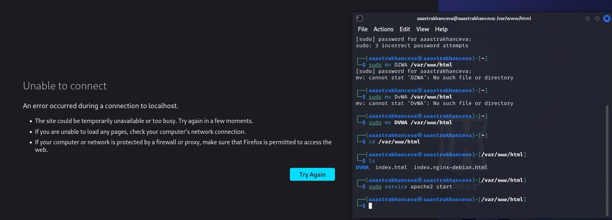
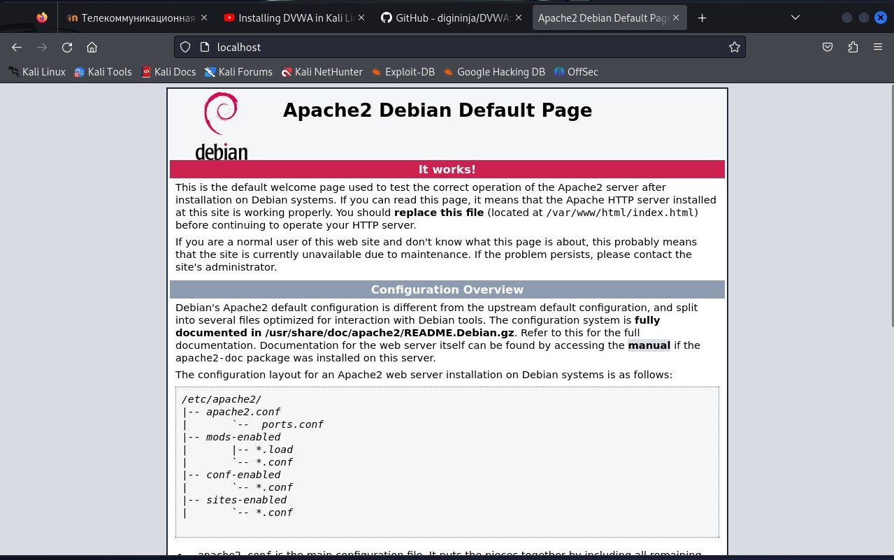
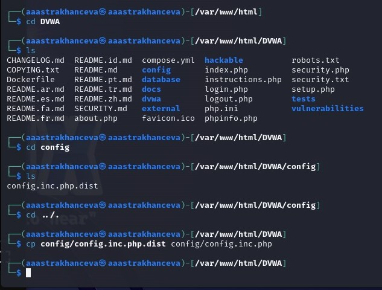
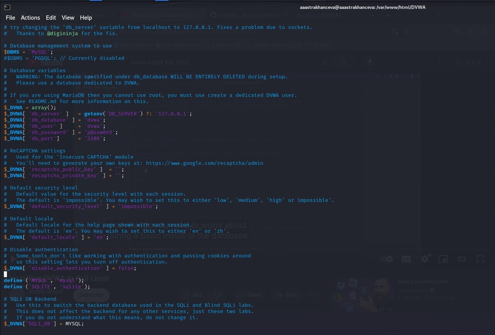
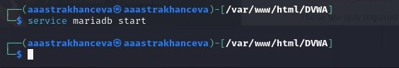
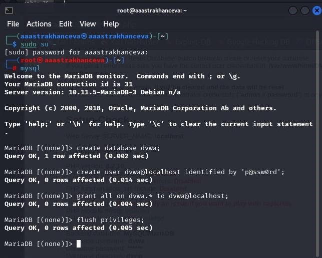
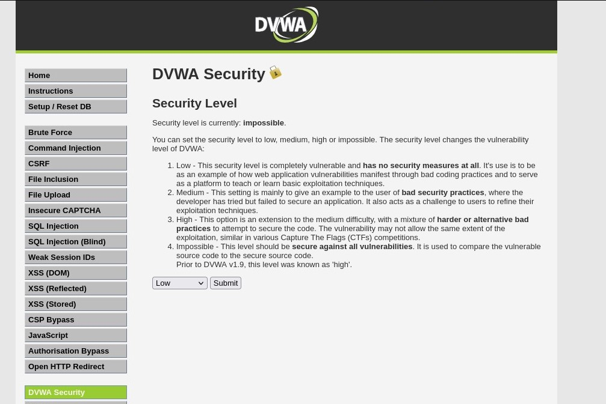

---
## Front matter
lang: ru-RU
title: Персональный проект. Этап №2
subtitle: Основы информационной безопастности
author:
  - Астраханцева А. А.
institute:
  - Российский университет дружбы народов, Москва, Россия
date: 15 марта 2024

## i18n babel
babel-lang: russian
babel-otherlangs: english

## Formatting pdf
toc: false
toc-title: Содержание
slide_level: 2
aspectratio: 169
section-titles: true
theme: metropolis
header-includes:
 - \metroset{progressbar=frametitle,sectionpage=progressbar,numbering=fraction}
 - '\makeatletter'
 - '\beamer@ignorenonframefalse'
 - '\makeatother'
---

## Докладчик

:::::::::::::: {.columns align=center}
::: {.column width="70%"}

  * Астраханцева Анастасия Александровна
  * студентка НКАбд-01-22
  * Студ. билет: 1132226437
  * Российский университет дружбы народов
  * <https://anastasiia7205.github.io/>

:::
::: {.column width="50%"}

:::
::::::::::::::

## Цель работы

Ознакомление с специально предназначенным для поиска уязвимостей  веб приложением под названием Damn Vulnerable Web Application (DVWA). 

# Выполнение работы

## Репозиторий github DVWA

Переходим в репозиторий github DVWA.

{#fig:001 width=70%}

## Клонирование репозиторияи

Клонируем репозиторий.

{#fig:002 width=70%}

## Перемещение DVWA

Перемещаем файл DVWA.

{#fig:003 width=70%}

## Запуск apache сервера

Полсле этого запускаем apache сервер.

{#fig:004 width=70%}

## Сообщение о конфигуцационном файле

{#fig:005 width=70%}

## Копирование конфигурационного файла

Вполняем копирование.

{#fig:006 width=70%}

## Просмотр конфигурационного файла

Далее просматриваем конфигурационный файл с помощью vim.

{#fig:007 width=70%}

## Зпауск mariadbи

Заупскаем mariadb для работы с базами данных.

{#fig:008 width=70%}

## Необходимые настройки

Создаем новую базу данных.

{#fig:009 width=70%}

## Необходимые настройки

На этом установка окончена, переходим на "http://localhost/DVWA" для дальнейших необходимых настроек.

{#fig:010 width=70%}

## Выводы

В ходе выполнения второго этапа инивидуального проекта я ознакомилась с специально предназначенным для поиска уязвимостей веб приложением под названием Damn Vulnerable Web Application (DVWA). 

# Спасибо за внимание

