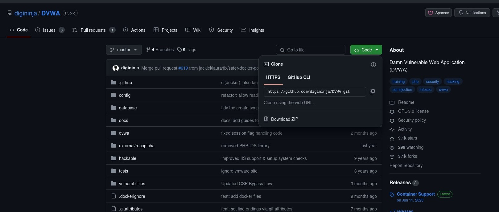
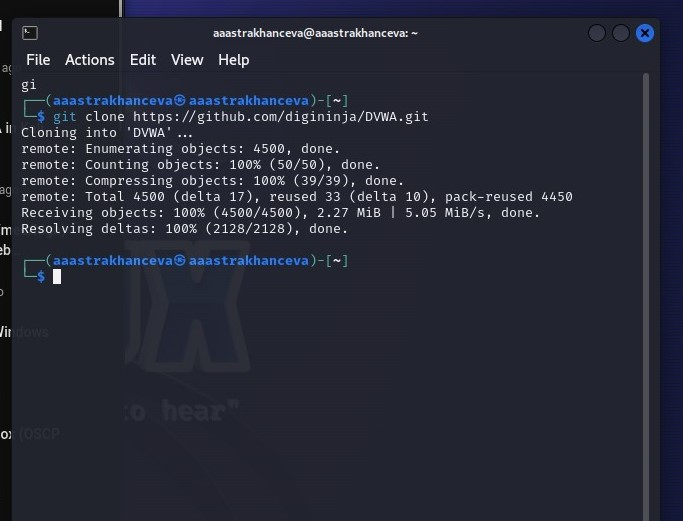
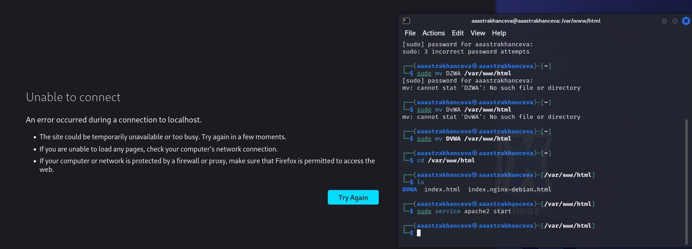
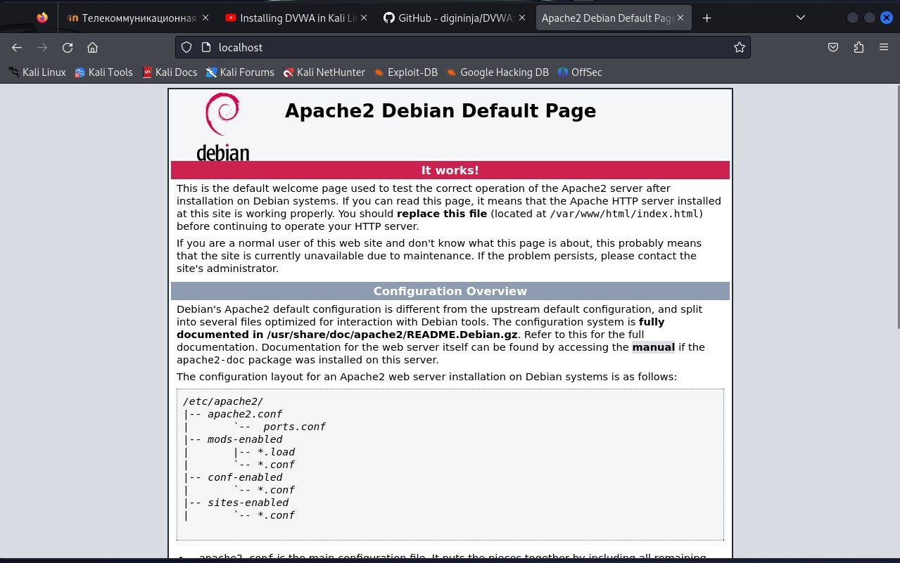
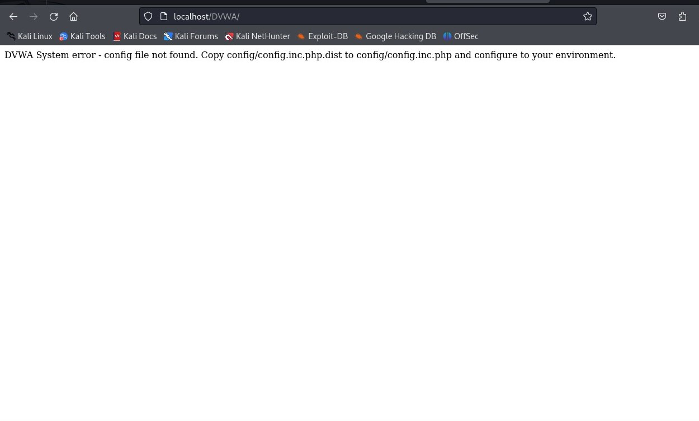
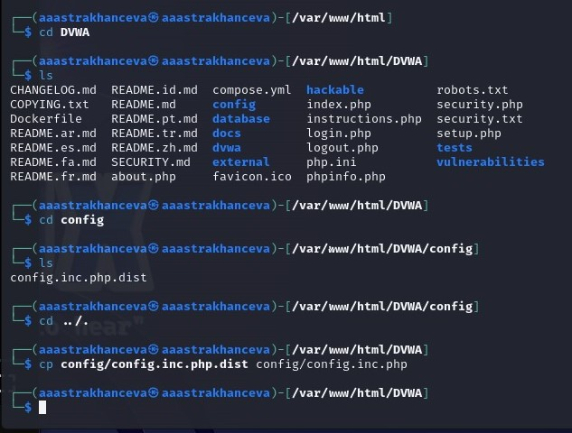
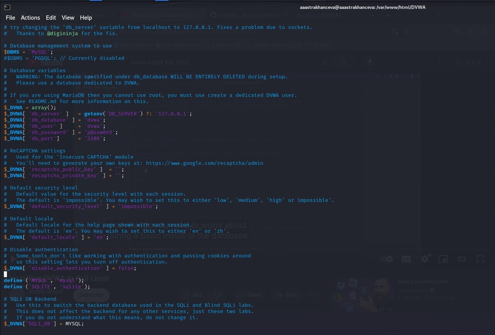
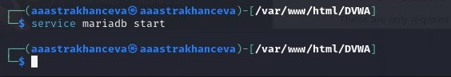
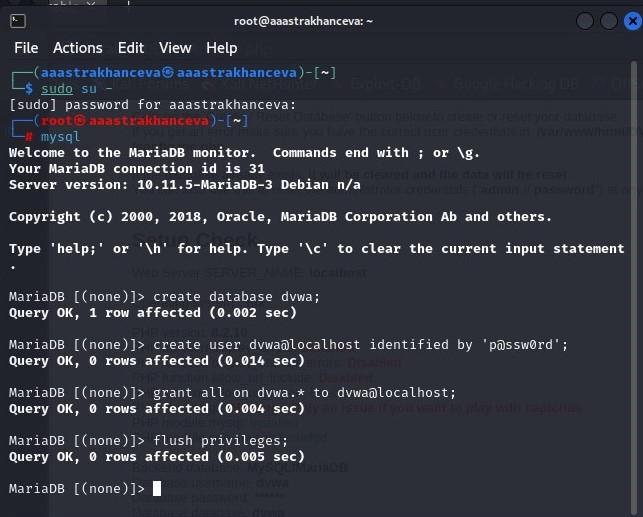
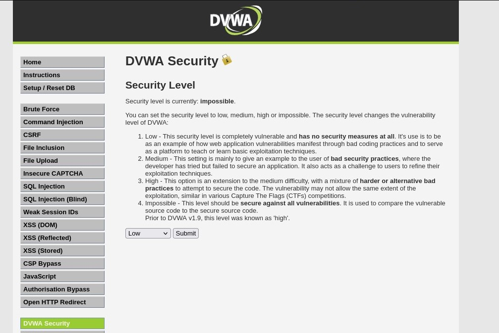

---
## Front matter
title: "Индивидуальный проект. Этап №2"
subtitle: "Основы инфомационной безопасности"
author: "Астраханцева А. А."

## Generic otions
lang: ru-RU
toc-title: "Содержание"

## Bibliography
bibliography: bib/cite.bib
csl: pandoc/csl/gost-r-7-0-5-2008-numeric.csl

## Pdf output format
toc: true # Table of contents
toc-depth: 2
lof: true # List of figures
lot: false # List of tables
fontsize: 12pt
linestretch: 1.5
papersize: a4
documentclass: scrreprt
## I18n polyglossia
polyglossia-lang:
  name: russian
  options:
	- spelling=modern
	- babelshorthands=true
polyglossia-otherlangs:
  name: english
## I18n babel
babel-lang: russian
babel-otherlangs: english
## Fonts
mainfont: PT Serif
romanfont: PT Serif
sansfont: PT Sans
monofont: PT Mono
mainfontoptions: Ligatures=TeX
romanfontoptions: Ligatures=TeX
sansfontoptions: Ligatures=TeX,Scale=MatchLowercase
monofontoptions: Scale=MatchLowercase,Scale=0.9
## Biblatex
biblatex: true
biblio-style: "gost-numeric"
biblatexoptions:
  - parentracker=true
  - backend=biber
  - hyperref=auto
  - language=auto
  - autolang=other*
  - citestyle=gost-numeric
## Pandoc-crossref LaTeX customization
figureTitle: "Рис."
tableTitle: "Таблица"
listingTitle: "Листинг"
lofTitle: "Список иллюстраций"
lotTitle: "Список таблиц"
lolTitle: "Листинги"
## Misc options
indent: true
header-includes:
  - \usepackage{indentfirst}
  - \usepackage{float} # keep figures where there are in the text
  - \floatplacement{figure}{H} # keep figures where there are in the text
---

# Цель работы

Ознакомление с специально предназначенным для поиска уязвимостей  веб приложением под названием Damn Vulnerable Web Application (DVWA). 

# Задание

Установка DVWA в гостевую систему к Kali Linux.

# Выполнение

Переходим в репозиторий github DVWA и копируем сслыку, по которой в дальнейшем будет клонировать репозиторий (рис. [-@fig:001]).

{#fig:001 width=70%}

Клонируем репозиторий у себя в терминале (рис. [-@fig:002]).

{#fig:002 width=70%}

Перемещаем файл DVWA по в папку "/var/www/html" и проверяем, что файл успешно перемещен (рис. [-@fig:003]).

{#fig:003 width=70%}

Полсле этого запускаем apache сервер и в бразузере открываем локальный сервер "http://localhost". (рис. [-@fig:004]).

{#fig:004 width=70%}

Переходим по адресу "http://localhost/DVWA", получаем сообщение о необходимости скопировать конфигурационный файл "config.inc.php.dist" в "config.inc.php". (рис. [-@fig:005]).

{#fig:005 width=70%}

Вполняем копирование (рис. [-@fig:006]).

{#fig:006 width=70%}

Далее просматриваем конфигурационный файл с помощью vim. Особое внимание уделяем паролю, в дальнейшем будем использовать его для создании базы данных (рис. [-@fig:007]).

{#fig:007 width=70%}

Заупскаем mariadb для работы с базами данных (рис. [-@fig:008]).

{#fig:008 width=70%}

Создаем новую базу данных. Для начала переходим в режим sudo-пользователя, потом с помощью команды `mysql` запускаем монитор MariaDB. Далее создаем новую базу данных, добавляем пользователя, указвваем его пароль. (рис. [-@fig:009]).

{#fig:009 width=70%}

На этом установка окончена, переходим на "http://localhost/DVWA" для дальнейших необходимых настроек. (рис. [-@fig:010]).

{#fig:010 width=70%}

# Выводы

В ходе выполнения второго этапа инивидуального проекта я ознакомилась с специально предназначенным для поиска уязвимостей веб приложением под названием Damn Vulnerable Web Application (DVWA). 

