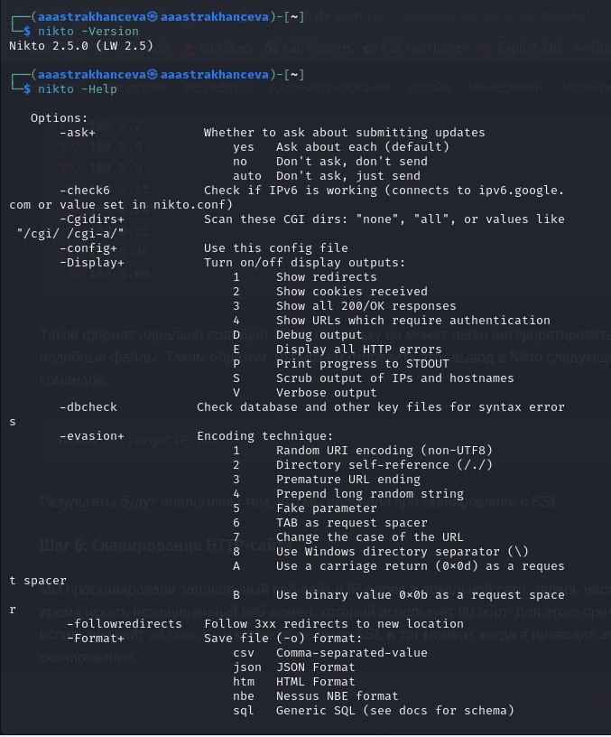
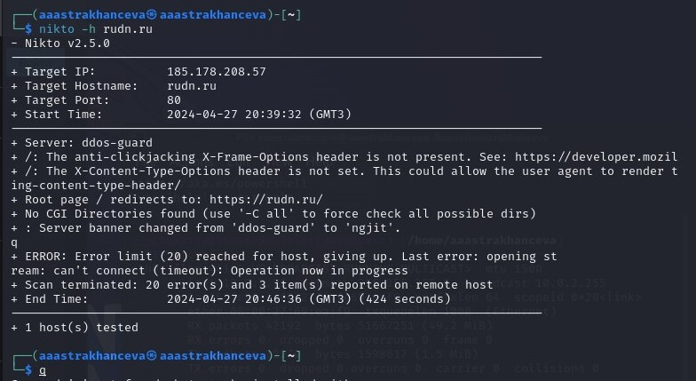

---
## Front matter
lang: ru-RU
title: Персональный проект. Этап №4
subtitle: Основы информационной безопастности
author:
  - Астраханцева А. А.
institute:
  - Российский университет дружбы народов, Москва, Россия
date: 27 апреля 2024

## i18n babel
babel-lang: russian
babel-otherlangs: english

## Formatting pdf
toc: false
toc-title: Содержание
slide_level: 2
aspectratio: 169
section-titles: true
theme: metropolis
header-includes:
 - \metroset{progressbar=frametitle,sectionpage=progressbar,numbering=fraction}
 - '\makeatletter'
 - '\beamer@ignorenonframefalse'
 - '\makeatother'
---

## Докладчик

:::::::::::::: {.columns align=center}
::: {.column width="70%"}

  * Астраханцева Анастасия Александровна
  * студентка НКАбд-01-22
  * Студ. билет: 1132226437
  * Российский университет дружбы народов
  * <https://anastasiia7205.github.io/>

:::
::: {.column width="50%"}

:::
::::::::::::::

## Цель работы

Знакомство со сканером безопастности Nikto и применение.

# Выполнение работы

## Теоретическое введенние

Nikto – бесплатный (open source) сканер для поиска уязвимостей в веб-серверах. Утилита относиться к классу blackbox сканеров, т. е. сканеров, использующих стратегию сканирования методом черного ящика. Это значит, что заранее неизвестно о внутреннем устройстве программы/сайта (доступ к исходному коду отсутствует) и упор сделан на функциональность. Программа может обнаруживать более 6700 потенциально опасных файлов и уязвимостей. Новые уязвимости добавляются в базу данных программы по мере их возникновения. Помимо поиска уязвимостей, сканер производит поиск на наличие устаревших версий, используемых библиотек и фреймворков. Nikto не позиционируется как стелс сканер (стелс сканеры никогда не устанавливают TCP-соединения до конца, тем самым сканирование происходит скрытно) – при сканировании сайта в логах сайта или в любой другой системе обнаружения вторжений, если она используется, будет отображена информация о том, что сайт подвергается сканированию.

## Провесрка версии и просмотр справки

{#fig:001 width=70%}

## Проверка работы сканера на сайте rudn.ru

{#fig:002 width=70%}

## Выводы

Познакомилась со сканером безопастности Nikto и примениа его для сканирования сайта.

# Спасибо за внимание

