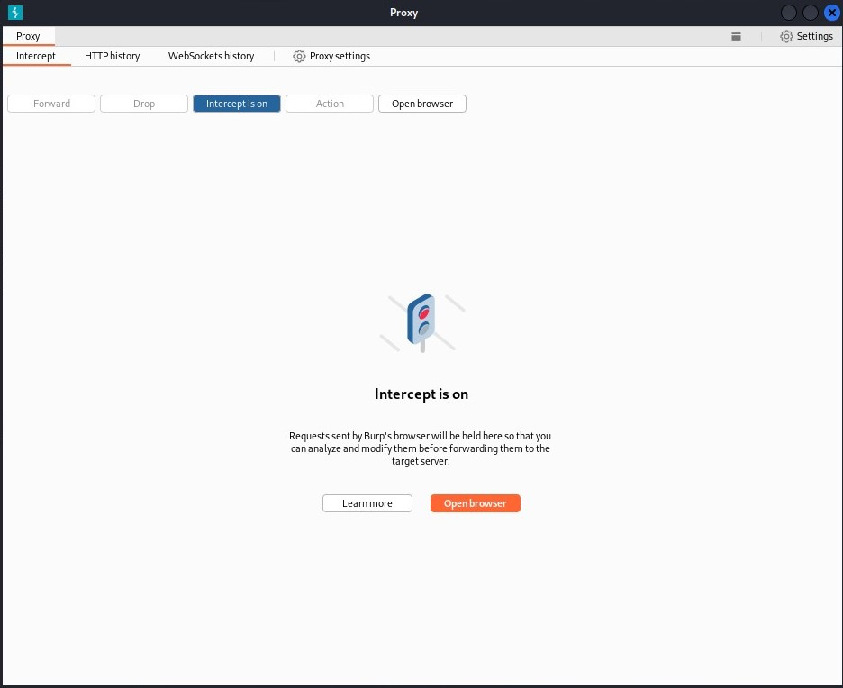

---
## Front matter
lang: ru-RU
title: Персональный проект. Этап №5
subtitle: Основы информационной безопастности
author:
  - Астраханцева А. А.
institute:
  - Российский университет дружбы народов, Москва, Россия
date: 11 мая 2024

## i18n babel
babel-lang: russian
babel-otherlangs: english

## Formatting pdf
toc: false
toc-title: Содержание
slide_level: 2
aspectratio: 169
section-titles: true
theme: metropolis
header-includes:
 - \metroset{progressbar=frametitle,sectionpage=progressbar,numbering=fraction}
 - '\makeatletter'
 - '\beamer@ignorenonframefalse'
 - '\makeatother'
---

## Докладчик

:::::::::::::: {.columns align=center}
::: {.column width="70%"}

  * Астраханцева Анастасия Александровна
  * студентка НКАбд-01-22
  * Студ. билет: 1132226437
  * Российский университет дружбы народов
  * <https://anastasiia7205.github.io/>

:::
::: {.column width="50%"}

:::
::::::::::::::

## Цель работы

Знакомство с инструментами Burp Suite и их применение.

# Выполнение работы

## Окно Burp Suite

Находим Burp Suite среди встроенных приложения и открываем его.

{#fig:001 width=70%}

## Окно Burp Suite

Будем производить взлома учетных данных, что-бы получить доступ к приложению DVWA. Для этого сначала нужно настроить прокси-сервер.

{#fig:002 width=70%}

## Настройка прокси в браузере

Теперь нужно настроить браузер для своего прокси-сервера.

{#fig:003 width=70%}

## Настройка прокси в браузере

Теперь нужно посетить целевой сайт. Браузер должен оставаться в режиме подключения.

{#fig:004 width=70%}

## Карта сайта

На вкладке Target теперь будут некоторые данные на внутренней вкладке Site map.

{#fig:005 width=70%}

## Заполучение перехватчиком данных

Сгенерируем трафик, которым воспользуется инструмент — нарушитель Burp Suite.

{#fig:006 width=70%}

## Вкладка Intruder Positions

Отпрвляем данный злоумышленнику. На вкладке Intruder переходим на вкладку Positions (Позиции). 

{#fig:007 width=70%}

## Вкладка Payload set 1

Если щелкнутьна Payload set (Набор полезных нагрузок), мы увидим количество позиций полезных нагрузок. Выбераем значение 1. Оно будет соответствовать полю username. 

{#fig:008 width=70%}

## Вкладка Payload set 2

Теперь в поле ввода Payload set  выбераем полезную нагрузку 2, отвечающую за поле пароля.
{#fig:009 width=70%}

## Результаты атаки

После этого появится окно с результатами (Results).

{#fig:010 width=70%}

## Вкладка Repeater

 Теперь мы можем перейти на страницу входа DVWA и предоставить доступ к сайту. 
 
{#fig:011 width=70%}

## Вкладка Repeater Render

{#fig:012 width=70%}

## Выводы

Познакомилась с инструментами Burp Suite и применила их для атаки на целевой сайт.

# Спасибо за внимание

