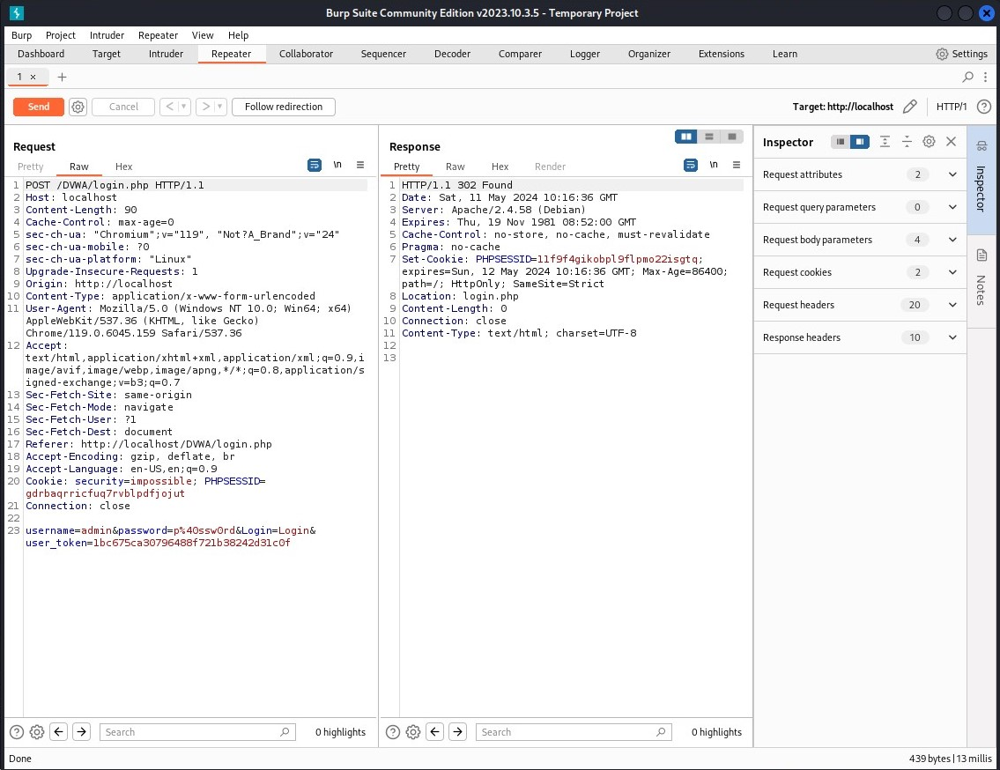
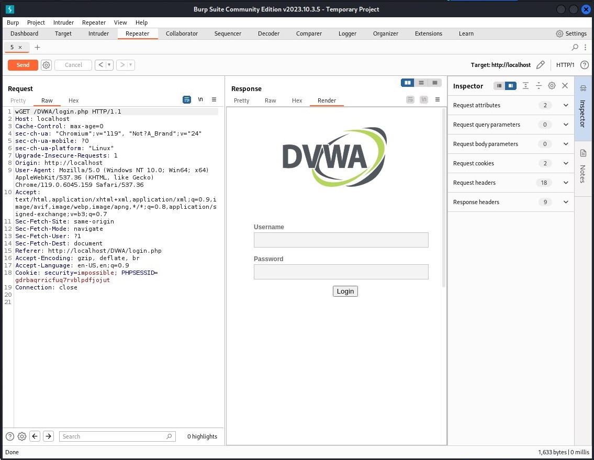

---
## Front matter
title: "Индивидуальный проект. Этап №5"
subtitle: "Основы инфомационной безопасности"
author: "Астраханцева А. А."

## Generic otions
lang: ru-RU
toc-title: "Содержание"

## Bibliography
bibliography: bib/cite.bib
csl: pandoc/csl/gost-r-7-0-5-2008-numeric.csl

## Pdf output format
toc: true # Table of contents
toc-depth: 2
lof: true # List of figures
lot: false # List of tables
fontsize: 12pt
linestretch: 1.5
papersize: a4
documentclass: scrreprt
## I18n polyglossia
polyglossia-lang:
  name: russian
  options:
	- spelling=modern
	- babelshorthands=true
polyglossia-otherlangs:
  name: english
## I18n babel
babel-lang: russian
babel-otherlangs: english
## Fonts
mainfont: PT Serif
romanfont: PT Serif
sansfont: PT Sans
monofont: PT Mono
mainfontoptions: Ligatures=TeX
romanfontoptions: Ligatures=TeX
sansfontoptions: Ligatures=TeX,Scale=MatchLowercase
monofontoptions: Scale=MatchLowercase,Scale=0.9
## Biblatex
biblatex: true
biblio-style: "gost-numeric"
biblatexoptions:
  - parentracker=true
  - backend=biber
  - hyperref=auto
  - language=auto
  - autolang=other*
  - citestyle=gost-numeric
## Pandoc-crossref LaTeX customization
figureTitle: "Рис."
tableTitle: "Таблица"
listingTitle: "Листинг"
lofTitle: "Список иллюстраций"
lotTitle: "Список таблиц"
lolTitle: "Листинги"
## Misc options
indent: true
header-includes:
  - \usepackage{indentfirst}
  - \usepackage{float} # keep figures where there are in the text
  - \floatplacement{figure}{H} # keep figures where there are in the text
---

# Цель работы

Знакомство с инструментами Burp Suite и их применение.

# Теоретическое введение

Burp Suite представляет собой набор мощных инструментов безопасности веб-приложений, которые демонстрируют реальные возможности злоумышленника, проникающего в веб-приложения. Эти инструменты позволяют сканировать, 
анализировать и использовать веб-приложения с помощью ручных и автоматических методов. Интеграция интерфейсов этих инструментов обеспечивает полную платформу атаки для обмена информацией между одним или несколькими инструментами, что делает Burp Suite очень эффективной и простой в использовании платформой для атаки веб-приложений.

# Выполнение

Находим Burp Suite среди встроенных приложения и открываем его (рис. [-@fig:001]).

{#fig:001 width=70%}

В качестве знакомства работы с Burp, я буду использовать его для взлома учетных данных, что-бы получить доступ к приложению DVWA. Для этого нам сначала потребуется настроить прокси-сервер и убедиться, что для IP установлено значение localhost IP, а.номер порта — 8080.Откроем вкладку Proxy (Прокси). На нейбудет несколько вложенных вкладок.

Откроем вкладку Intercept (Перехват) и в первую очередь убедимся, что функция перехвата включена (нажата кнопка Intercept is on (Перехват.на))(рис. [-@fig:002]). 

{#fig:002 width=70%}

Открываем браузер и переходим в раздел настройек подключения. Теперь нужно настроить браузер для своего прокси-сервера (рис. [-@fig:003]). 

{#fig:003 width=70%}

Теперь нужно посетить целевой сайт. В нашем случае целевым сайтом будет http://localhost/DVWA Браузер должен оставаться в режиме подключения. Но если посмотреть на интерфейс Burp Suite, мы уже увидим данные, которые программа смогла получить (рис. [-@fig:004]). 

{#fig:004 width=70%}

После нескольких нажатий кнопки Forward (Вперед) браузер загрузит веб-страницу. В Burp Suite на вкладке Target (Цель) теперь будут некоторые данные на внутренней вкладке Site map (Карта сайта) (рис. [-@fig:005]).

{#fig:005 width=70%}

Вернемся на нашу страницу, открытую на целевом сайте. Сгенерируем трафик, которым воспользуется инструмент — нарушитель Burp Suite. Для этого в форме входа на странице введем случайные учетные данные. После ввода учетных данных увидим, какие сведения смог захватить перехватчик (логин и пароль) (рис. [-@fig:006]).

{#fig:006 width=70%}

Теперь щелкаем правой кнопкой мыши на целевом хосте и выбераем в появившемся контекстном меню команду Send to Intruder (Отправить злоумышленнику). На вкладке Intruder (Злоумышленник) переходим на вкладку Positions (Позиции). Прежде чем продолжить, необходимо убедиться, что выбран тип атаки Cluster bomb (рис. [-@fig:007]).

{#fig:007 width=70%}

Если щелкнутьна Payload set (Набор полезных нагрузок), мы увидим количество позиций полезных нагрузок.
Выбераем значение 1. Оно будет соответствовать полю username. В раскрывающемся списке Playload type выбераем Simple list. Ниже, в разделе Payload Options (Параметры полезной нагрузки) вводим в поле ввода имя пользователя и нажмимаем ткнопку Add (Добавить). Это имя будет использоваться злоумышленником в качестве имени пользователя. 

Теперь в поле ввода Payload set  выбераем полезную нагрузку 2, отвечающую за поле пароля. После того, как все настройки будут выполнены, нажмиаем кнопку Start attack (Начало.атаки) (рис. [-@fig:008] - [-@fig:009]).

{#fig:008 width=70%}

{#fig:009 width=70%}

После этого появится окно с результатами (Results). Глядя на эти результаты, мы видим, что все попытки атаки получили статус (код ответа HTTP) 302, это код перенаправления. Если щеокнуть на результат, а затем выбрать вкладку Response (Ответ), то увидим, что все запросы перенаправляются на index.php (рис. [-@fig:010]).

{#fig:010 width=70%}

 Теперь мы можем перейти на страницу входа DVWA и предоставить доступ к сайту. Для этого нам потребуется ввести учетные данные Кроме того, используя инструмент Repeater, мы можем проверить эти результаты в Burp Suite. Ретранслятор предназначен для ручного изменения HTTP-запросов и данных, отправляемых в этих запросах. Вернемся на вкладку Target, выберием для входа в login.php запрос.POST. Это форма запроса, в которой отправляется имя пользователя и пароль. Отправим данный запром в ретранслятор. перейдем в данную папку. После password= удаляем неверный пароль и вводим тот, который перенаправит нас на index.php. И нажимаем кнопку Go. В результате этих действий мы должны во вкладке response увидеть, что локация теперь будет index.php. После нажатия на кнопку Follow redirection (Переадресация) во вкладке Renderмы увидим, как должна выглядеть страница (у меня это почему-то не получилось, хотя я вводила правильный пароль и логин) (рис. [-@fig:011] - [-@fig:012]).
 
{#fig:011 width=70%}

{#fig:012 width=70%}

# Выводы

Познакомилась с инструментами Burp Suite и применила их для атаки на целевой сайт.

# Список литературы. Библиография

[1] Парасрам Шива, Замм Алекс, Хериянто Теди, Али Шакил, Буду Дамиан, Йохансен Джерард, Аллен Ли. П18 Kali Linux. Тестирование на проникновение и безопасность. — СПб.: Питер, 2020. — 448 с.: ил. — (Серия «Для профессионалов»). ISBN 978-5-4461-1252-4
